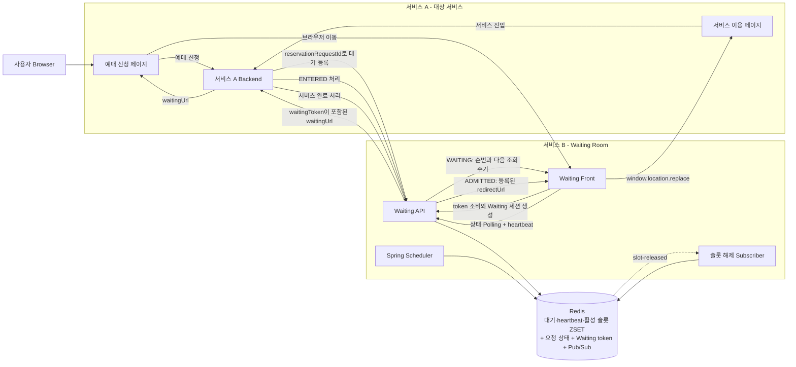
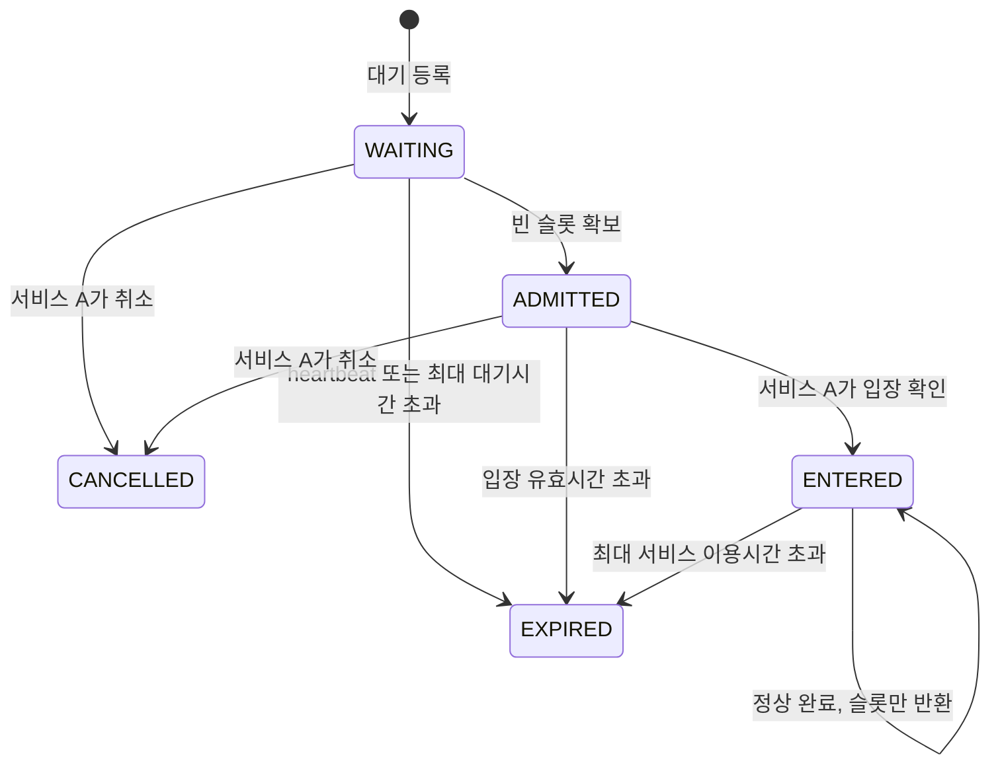
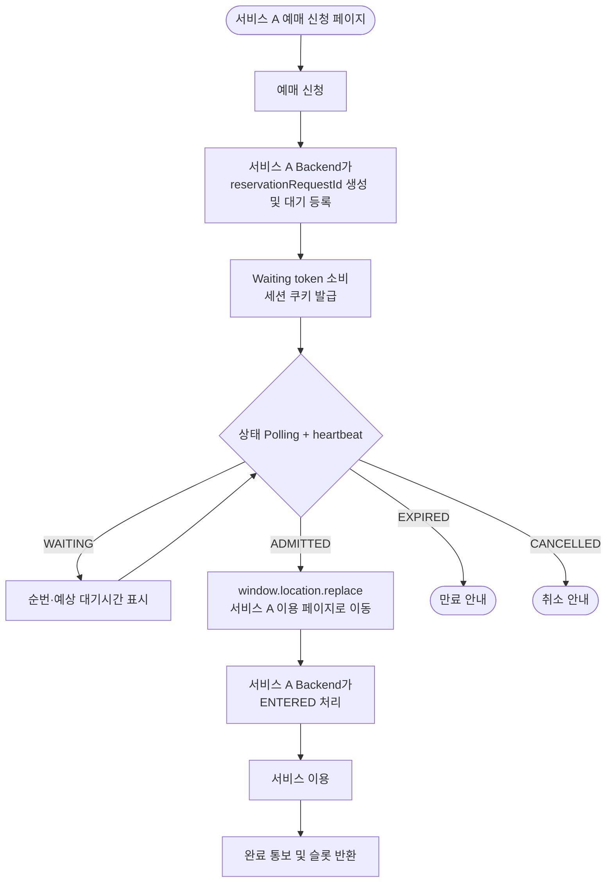
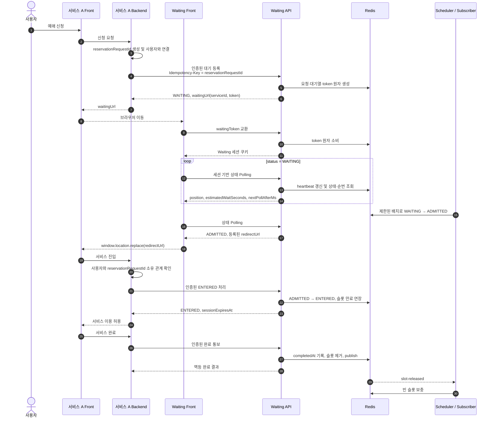

# Waiting Room 핵심 기능 구조

- 상태: 핵심 대기·입장·완료 흐름 구현 완료, Waiting token·세션 보안과 운영 복구 기능은 후속 적용
- 대상: 서비스 A와 Waiting Room 개발자
- 범위: 대기 등록, Waiting 세션, 상태 Polling, 동시 이용자 수 기반 입장, 서비스 완료에 따른 슬롯 반환
- 핵심 원칙: 하나의 요청은 전체 업무 흐름에서 `reservationRequestId` 하나로 식별한다.
- Browser 제약: 한 Browser에서는 Waiting origin의 고정 쿠키로 활성 Waiting 세션 하나만 유지한다.
- 제외: Redis 장애로 인한 데이터 유실 복구, 장기 이력 저장, 자동 용량 증감

## 1. 목적과 전제

시스템은 다음 두 서비스로 구성한다.

- **서비스 A - 대상 서비스**: 예매 신청부터 실제 서비스 이용과 완료까지 담당한다.
- **서비스 B - Waiting Room**: 대기 순서, 입장 허용 상태와 동시 이용 슬롯을 관리한다.

서비스 A Backend가 전역에서 유일한 `reservationRequestId`를 생성한다. 이 값은 다음 용도로 동일하게 사용한다.

- HTTP `Idempotency-Key`
- Redis Sorted Set member
- 상태 전이 식별자
- 서비스 간 전달 식별자

별도의 대기열 ID, 입장 ID 또는 완료 ID는 만들지 않는다. 다만 Browser가 Waiting 세션을 안전하게 시작하기 위한 짧은 수명의 일회용 `waitingToken`은 보안 자격으로 별도 발급한다. `waitingToken`은 업무 식별자가 아니다.

Waiting Room은 초당 요청 수가 아니라 **서비스 A가 동시에 수용할 수 있는 최대 이용자 수**를 기준으로 입장을 허용한다. 요청이 `ADMITTED`가 되는 순간 슬롯을 점유하고, 서비스가 완료되거나 슬롯 만료시간을 넘을 때까지 유지한다.

## 2. 전체 아키텍처



Waiting 서버가 Browser를 직접 redirect하지 않는다. Waiting Front가 상태를 Polling하다가 `ADMITTED` 응답을 받으면 `window.location.replace(redirectUrl)`로 서비스 A에 이동한다.

서비스 A는 Browser가 돌아오면 자신이 보관한 `reservationRequestId`와 사용자 또는 세션의 소유 관계를 확인한다. 이후 서비스 A Backend가 Waiting API에 입장 처리를 요청하여 `ADMITTED`를 `ENTERED`로 변경한다.

## 3. 구성요소 책임

| 구성요소 | 책임 |
|---|---|
| 서비스 A 예매 신청 페이지 | 신청 요청, 발급받은 `waitingUrl`로 이동 |
| 서비스 A Backend | `reservationRequestId` 생성, 대기 등록, 서비스 진입 확인, 완료·취소 통보 |
| 서비스 A 이용 페이지 | 입장 허용된 사용자의 실제 서비스 이용 |
| Waiting Front | 일회용 token 교환, 상태 Polling, heartbeat, 순번 표시, 서비스 A로 이동 |
| Waiting API | 멱등 등록, Waiting 세션, 상태 조회, 입장·완료·취소 처리 |
| Spring Scheduler | 이탈·만료 요청 정리와 빈 슬롯 보충을 설정된 `schedulerInterval` 주기로 재조정 |
| 슬롯 해제 Subscriber | 내부 `slot-released` 신호를 받아 빈 슬롯을 즉시 보충 |
| Redis | 대기 순서, heartbeat, 활성 슬롯, 요청 상태와 내부 Pub/Sub 제공 |

Scheduler와 Subscriber는 Waiting API와 같은 Spring Boot 애플리케이션에 둔다. 별도 Worker나 외부 메시지 브로커는 추가하지 않는다.

## 4. 상태 모델



| 상태 | 의미 | 활성 슬롯 점유 |
|---|---|---|
| `WAITING` | 대기열에서 순서를 기다리는 상태 | 아니요 |
| `ADMITTED` | 입장이 허용됐지만 서비스 A가 아직 입장을 확인하지 않은 상태 | 예 |
| `ENTERED` | 서비스 A가 실제 진입을 확인한 상태 | 완료 전까지 예 |
| `EXPIRED` | heartbeat, 대기시간 또는 슬롯 유효시간이 만료된 상태 | 아니요 |
| `CANCELLED` | 서비스 A가 대기 또는 입장 허용을 취소한 상태 | 아니요 |

`ENTERED` 이후에는 `CANCELLED`로 전이하지 않는다. 정상 완료는 `completedAt`을 기록한 뒤 활성 슬롯만 반환한다. 완료 후에도 상태는 `ENTERED`이지만 서비스 이용은 종료되며, 활성 이용 여부는 `completedAt == null`과 활성 슬롯 membership을 함께 확인한다.

## 5. Redis 데이터 구조

모든 업무 Key는 `{serviceId}` hash tag를 사용한다. 초기 배포는 단일 Redis를 사용하지만, 이 규칙을 지키면 추후 Redis Cluster에서도 같은 서비스의 다중 Key Lua를 한 hash slot에서 실행할 수 있다. 따라서 Cluster를 도입해도 서로 다른 `serviceId`는 분산할 수 있지만, 단일 인기 서비스의 Key와 Lua 부하는 여러 shard로 나뉘지 않는다.

### 5.1 대기열

```text
Key    waiting:{serviceId}
Type   Sorted Set
Score  requestedAt의 Unix epoch milliseconds
Member reservationRequestId
```

- `ZADD NX`로 중복 등록을 막는다.
- 순번은 `ZRANK + 1`로 계산한다.
- 같은 millisecond에 등록된 요청은 `reservationRequestId` 사전순으로 결정된다.
- `ADMITTED`, `EXPIRED`, `CANCELLED`가 되면 제거한다.

### 5.2 Waiting heartbeat

```text
Key    waiting-heartbeat:{serviceId}
Type   Sorted Set
Score  lastPolledAt의 Unix epoch milliseconds
Member reservationRequestId
```

- 대기 등록 시 `requestedAt`을 최초 heartbeat score로 추가한다.
- Waiting 세션 생성과 정상 상태 Polling 시 현재 시각으로 score를 갱신한다.
- 정상 상태 Polling마다 현재 시각으로 score를 갱신한다.
- `lastPolledAt + heartbeatTimeout`이 현재 시각보다 작거나 같으면 이탈 요청으로 처리한다.
- `WAITING` 상태가 끝나면 제거한다.

### 5.3 활성 슬롯

```text
Key    active-slots:{serviceId}
Type   Sorted Set
Score  slotExpiresAt의 Unix epoch milliseconds
Member reservationRequestId
```

- `WAITING → ADMITTED` 시 추가하고 `admissionTimeout`을 만료시간으로 사용한다.
- `ADMITTED → ENTERED` 시 score를 `now + maxSessionDuration`으로 갱신한다.
- 정상 완료, 취소 또는 만료 시 제거한다.
- 가용 슬롯은 `max(0, maxConcurrentUsers - ZCARD(active-slots:{serviceId}))`로 계산한다.

#### 5.3.1 예상 대기시간용 슬롯 반환 이력

```text
Key    slot-release-events:{serviceId}
Type   Sorted Set
Score  slotReleasedAt의 Unix epoch milliseconds
Member reservationRequestId
TTL    etaWindow의 2배
```

- 예상 대기시간은 서비스 이용 완료시간이 아니라 현재 요청이 `ADMITTED`가 될 때까지의 시간이다. 유지보수 batch 제한과 다음 Scheduler 보정 실행까지의 지연도 포함한다.
- 정상 완료, `SESSION_TIMEOUT`, `ADMISSION_TIMEOUT`, `ADMITTED` 취소와 고아 활성 슬롯 정리에서 `active-slots` member가 실제로 제거된 경우만 반환 이벤트로 기록한다.
- 각 상태 변경 Lua는 `ZREM active-slots`의 결과가 `1`일 때만 같은 원자 처리 안에서 `ZADD slot-release-events`를 실행한다. 중복 완료나 이미 제거된 슬롯은 표본을 추가하지 않는다.
- `nowMs`는 각 Lua가 Redis `TIME`으로 얻은 millisecond 값이다. 최근 표본 범위는 `[nowMs - etaWindowMs, nowMs]`로 양 끝을 포함하고, 정리 시 cutoff보다 작은 score만 제거한다.
- 이벤트 기록 시 오래된 member를 제거하고 Key TTL을 `etaWindow * 2`로 갱신한다. Polling은 TTL을 갱신하지 않으므로 새 반환이 없으면 마지막 기록 후 자연 만료된다.
- Key는 다른 서비스 상태와 같은 `{serviceId}` hash tag를 사용한다. 각 Lua가 접근하는 모든 Key는 호출자가 `KEYS[]`로 전달하며 Lua 내부에서 Key 이름을 조합하지 않는다.
- Lua는 명령 사이의 interleaving을 막지만 runtime 오류 시 이전 쓰기를 rollback하지 않는다. 첫 쓰기 전에 Key type과 입력값을 검증하고 반환 이력 명령은 `redis.pcall`로 실행한다. `ZADD`, 오래된 표본 정리 또는 TTL 갱신 중 하나라도 실패하면 같은 script가 `slot-release-events` Key를 삭제해 이후 ETA를 `null`로 낮추고 오류를 경보한다. 파생 지표 이력 삭제에 성공한 경우만 일반 write gate 차단의 예외로 핵심 상태 전이를 유지하며, 이력 삭제도 실패하면 일반 쓰기 오류 규칙에 따라 write gate를 차단한다.

### 5.4 요청 상태

```text
Key    waiting-request:{serviceId}:{reservationRequestId}
Type   String(JSON)
TTL    생성 시점부터 requestTtl
```

```json
{
  "reservationRequestId": "reservation-123",
  "serviceId": "reservation-service",
  "status": "WAITING",
  "redirectTargetId": "service-entry",
  "payloadFingerprint": "sha256:...",
  "currentWaitingTokenHash": "sha256:...",
  "currentWaitingSessionHash": null,
  "waitingSessionVersion": 1,
  "createdAt": "2026-09-21T10:00:00Z",
  "admittedAt": null,
  "enteredAt": null,
  "completedAt": null,
  "expiredAt": null,
  "expirationReason": null
}
```

- 재등록 시 `serviceId`와 payload fingerprint가 같으면 현재 상태를 반환한다.
- 동일한 Idempotency-Key에 다른 payload가 들어오면 `409 Conflict`를 반환한다.
- 상태 변경은 기존 TTL을 유지한다.
- 상태 Key TTL은 전체 요청 생명주기보다 길어야 한다.

### 5.5 Waiting 접근 token

```text
Key    waiting-access:{serviceId}:{tokenHash}
Type   String(JSON)
TTL    5분

Value
{
  "serviceId": "reservation-service",
  "reservationRequestId": "reservation-123",
  "waitingSessionVersion": 1
}
```

- CSPRNG로 생성한 고엔트로피 token의 검증용 hash만 Key에 사용한다.
- Browser가 보낸 `serviceId`는 Key 조회 범위를 정하는 데만 사용하고, token에 저장된 값과 일치하는지 다시 검증한다.
- 최초 Waiting 페이지 접근에서 원자적으로 한 번만 소비한다.
- 요청 상태의 `currentWaitingTokenHash`와 일치하는 최신 token만 허용한다. 새 token을 발급하면 이전 token Key를 삭제한다.
- 소비 성공 시 서버가 `HttpOnly` Waiting 세션 쿠키를 발급한다.
- token은 URL fragment로 전달하고 Waiting Front가 읽은 즉시 `history.replaceState()`로 제거한다. fragment는 HTTP 요청·Referer·서버 로그에 전송되지 않으며 이후 Polling에는 사용하지 않는다.

### 5.6 Waiting 세션

```text
Key    waiting-session:{serviceId}:{sessionHash}
Type   String(JSON)
TTL    요청 상태 Key의 남은 TTL 이내

Value
{
  "serviceId": "reservation-service",
  "reservationRequestId": "reservation-123",
  "waitingSessionVersion": 1,
  "nextPollAllowedAt": null
}
```

- 쿠키는 공개 routing 값인 `serviceId`와 CSPRNG로 생성한 세션 secret으로 구성한다.
- Redis에는 세션 secret 원문 대신 hash를 사용한다.
- 쿠키의 `serviceId`는 Key 조회 범위만 정하며, 세션 레코드의 값과 일치해야 한다.
- 세션 생성과 token 소비는 같은 `{serviceId}` hash slot에서 원자적으로 처리한다.
- Polling은 세션 hash와 `waitingSessionVersion`이 요청 상태의 현재 값과 모두 일치할 때만 허용한다.
- 서비스 A는 자신의 로그인 또는 익명 Browser 세션별로 현재 `reservationRequestId` 하나를 저장한다. 이 값의 생성·교체는 DB transaction, compare-and-set 또는 unique constraint로 직렬화하고 승자 한 요청만 Waiting Room에 등록한다.
- Waiting origin의 `__Host-waiting_session` 쿠키는 Browser 전체에서 하나이므로 다른 서비스 A를 포함해 가장 최근 Waiting 세션만 Browser에서 유지한다. 같은 서비스 A가 소유한 기존 요청은 새 요청 전에 취소하고, 서비스 간 조정이 불가능한 이전 요청은 cookie 교체 후 heartbeat timeout으로 정리한다.

### 5.7 내부 슬롯 해제 채널

```text
Channel waiting-room:slot-released:{serviceId}
Payload reservationRequestId
```

Pub/Sub은 빈 슬롯을 빠르게 보충하기 위한 내부 신호일 뿐 상태 저장소가 아니다. 메시지가 유실돼도 Scheduler가 Redis 상태를 기준으로 설정된 `schedulerInterval` 안에 다시 조정한다. 외부 서비스에는 Redis와 Pub/Sub을 노출하지 않는다.

### 5.8 유지보수 실행 lease

```text
Key    maintenance-lease:{serviceId}
Type   String(instanceId)
TTL    한 번의 유지보수 실행 제한시간
```

- Scheduler와 Pub/Sub Subscriber는 실행 전에 `SET ... NX PX`로 서비스별 lease를 획득한다.
- lease를 획득한 한 인스턴스만 만료 정리와 빈 슬롯 보충 Lua를 실행한다.
- 정상 종료 시 단일 compare-and-delete Lua로 소유자가 일치할 때만 lease를 삭제하고, 인스턴스 중단 시에는 TTL로 해제한다.
- Pub/Sub 신호가 여러 인스턴스에 전달돼도 같은 서비스의 중복 실행을 억제한다.

### 5.9 heartbeat 만료 복구 barrier

```text
Key    maintenance-heartbeat:{serviceId}
Type   String(마지막 유지보수 성공 시각)
TTL    maintenanceHealthTimeout

Key    heartbeat-expiry-barrier:{serviceId}
Type   String(JSON)
TTL    heartbeatExpirationRecoveryGrace + cleanupMargin

Value
{
  "recoveryId": "01J8RECOVERY...",
  "expiresAt": "2026-09-21T10:20:00Z"
}
```

- lease를 획득한 인스턴스는 유지보수 성공 후 `maintenance-heartbeat`를 갱신한다.
- 각 인스턴스는 시작 또는 Redis 연결 단절 시 readiness를 닫고 Polling과 상태 변경 요청에 `503`을 반환한다.
- Redis 연결이 복구되면 bootstrap Lua가 최근 `maintenance-heartbeat`를 확인한다. 값이 있으면 정상 인스턴스가 계속 동작한 것으로 보고 barrier를 만들지 않는다.
- `maintenance-heartbeat`가 없거나 만료됐으면 bootstrap Lua가 기존 barrier를 재사용하거나, barrier가 없을 때만 새 `recoveryId`와 `now + heartbeatExpirationRecoveryGrace`를 기록한다. 다른 인스턴스가 늦게 복구돼도 기존 barrier를 연장하지 않는다.
- bootstrap Lua가 성공한 뒤에만 readiness를 열어 Polling, Scheduler와 상태 변경 요청을 허용한다.
- Polling과 유지보수 Lua는 이 시각 전까지 `HEARTBEAT_TIMEOUT` 만료를 적용하지 않는다.
- `maxWaitDuration`, `ADMISSION_TIMEOUT`, `SESSION_TIMEOUT`은 복구 barrier와 관계없이 적용한다.

### 5.10 손상 상태 격리

```text
Key    waiting-quarantine:{serviceId}:{reservationRequestId}:{detectedAt}
Type   String(손상된 원문)
TTL    quarantineTtl
```

- 상태 JSON decode에 실패하면 원문을 격리 Key에 저장해 운영 확인 근거를 남긴다.
- 같은 Lua에서 요청 상태를 최소한의 `EXPIRED`, `STATE_CORRUPTED` JSON으로 교체하되 기존 요청 상태 Key의 남은 TTL을 유지한다.
- 격리 Key는 자동 복구에 사용하지 않으며 개인정보와 token 원문을 포함하지 않도록 상태 payload 자체를 제한한다.

### 5.11 서비스 변경 gate

```text
Key    writes-enabled:{serviceId}
Type   String("1")
TTL    없음

Key    recovery-lease:{serviceId}
Type   String(recoveryOwnerId)
TTL    복구 작업 제한시간
```

- `writes-enabled`는 배포 시 서비스마다 미리 생성하고 애플리케이션이 임의로 복원하지 않는다.
- 등록, token·세션, Polling heartbeat, 입장, 완료, 취소와 유지보수 Lua는 첫 쓰기 전에 gate 존재를 확인한다. 없으면 아무것도 변경하지 않고 `503`을 반환한다.
- Lua의 예상 밖 쓰기 오류는 `redis.pcall`로 확인한다. 오류가 발생하면 같은 script가 `writes-enabled`를 삭제하고 조회한 전체 후보 ID를 오류 결과에 포함한다. Key 삭제는 메모리를 늘리지 않는다.
- 응답에서 영향 ID를 얻지 못했거나 batch 중간 오류 가능성이 있으면 해당 `serviceId` 전체를 영향 범위로 본다.
- 복구 도구만 `recovery-lease`를 획득할 수 있다. break-glass Redis 계정으로 요청 상태 Key pattern과 대기·heartbeat·활성 슬롯 member 전체를 제한된 cursor scan으로 대조하고 불일치를 종료·격리한다.
- 메모리 여유와 정합성 검증이 모두 통과한 단일 복구 소유자만 `writes-enabled`를 다시 생성한다. 모든 AP, Scheduler와 Subscriber는 같은 gate를 확인하므로 동시에 재개한다.

## 6. 사용자 흐름



## 7. 전체 시퀀스



## 8. 원자 처리

모든 Lua script는 Redis `TIME`과 필요한 Key type, 입력값, 상태 JSON을 쓰기 전에 검증한다. Redis Lua는 실행 중 오류가 발생해도 이전 쓰기를 롤백하지 않으므로 다음 원칙을 공통 적용한다.

1. 공유 ZSET과 필수 Key의 type이 올바르지 않으면 쓰기 전에 전체 실행을 실패시킨다.
2. 모든 변경 script는 `writes-enabled:{serviceId}`를 확인한다. gate가 없으면 쓰기 없이 `503`으로 끝낸다.
3. batch script는 후보를 제한된 수만큼 읽고 검증한 뒤 변경을 시작한다.
4. 개별 요청 상태가 없으면 아래 고아 정리 규칙을 적용한다.
5. 개별 요청 JSON은 보호된 decode로 읽는다. 손상됐으면 원문을 짧은 TTL의 격리 Key에 보관하고 아래 상태별 안전 종료 규칙을 적용한다. 한 요청의 손상 때문에 앞선 요청만 변경된 채 전체 script가 실패하지 않게 한다.
6. 쓰기 명령의 예상 밖 오류는 `redis.pcall`로 확인하고 service 변경 gate를 내린 뒤 후보 ID와 함께 반환한다. 구현 시 Redis 쓰기 오류, JSON decode와 type 오류를 강제로 주입해 부분 변경 탐지와 전역 차단을 검증한다.

### 8.1 대기 등록

등록 Lua script는 다음 작업을 한 번에 처리한다.

1. 요청 상태 Key가 있으면 인증된 `serviceId`와 payload fingerprint를 비교한다.
2. 모두 같으면 token과 Redis 상태를 변경하지 않고 현재 상태를 반환한다.
3. 다르면 값을 변경하지 않고 `409 Conflict`를 반환한다.
4. 상태 Key가 없으면 요청 상태를 `requestTtl`로 저장한다.
5. 대기 ZSET과 heartbeat ZSET에 `ZADD NX`로 등록한다.
6. `waitingSessionVersion=1`인 일회용 `waitingToken`을 `waitingTokenTtl`로 저장한다.
7. 신규 등록에만 `waitingUrl`을 반환한다.

쓰기 전에 Key type과 입력값을 검증한다. Redis Lua는 오류 발생 전의 쓰기를 자동 롤백하지 않으므로 검증 이후 쓰기를 시작한다.

payload fingerprint는 `serviceId`와 `redirectTargetId`처럼 등록 결과에 영향을 주는 필드를 고정된 순서와 인코딩으로 정규화한 뒤 SHA-256으로 계산한다. JSON 문자열 자체를 hash하지 않는다.

### 8.2 Waiting token 소비와 Polling

token 소비는 요청의 `serviceId`와 token hash로 Key를 찾은 뒤, 저장된 `serviceId`, 최신 token hash와 `waitingSessionVersion` 일치 확인, token 삭제, 요청 상태의 token hash 제거와 Waiting 세션 생성을 하나의 원자 처리로 묶는다. 기존 `currentWaitingSessionHash`가 있으면 이전 세션 Key를 삭제하고 새 session hash를 요청 상태에 기록한다. `WAITING`은 최대 대기시간이 유효하고 heartbeat가 유효하거나 복구 barrier가 활성일 때, `ADMITTED`는 활성 슬롯이 만료 전일 때만 세션을 만든다. 시간상 이미 만료된 요청은 같은 script에서 `EXPIRED`로 정리하고 token을 폐기한다. `ENTERED`, `EXPIRED`, `CANCELLED`, 이미 소비됐거나 만료된 token도 거부한다. Browser가 보낸 `serviceId`만으로 요청을 조회하거나 권한을 부여하지 않는다.

상태 Polling은 Waiting 세션에서 `serviceId`와 `reservationRequestId`를 얻는다. 하나의 원자 Lua script에서 다음을 수행한다.

1. 세션과 요청의 연결, session hash와 `waitingSessionVersion`이 요청 상태의 현재 값과 일치하는지 확인한다. 이전 세션이면 heartbeat를 갱신하지 않고 `401`을 반환한다.
2. Redis `TIME`으로 현재 시각을 구하고 요청 상태와 heartbeat를 읽는다.
3. `WAITING`인데 대기 또는 heartbeat ZSET member가 없으면 어떤 member도 다시 만들지 않고 남은 member를 제거한 뒤 `EXPIRED`, `INTERNAL_INCONSISTENCY`로 종료한다. 같은 ID를 자동 재등록하지 않는다.
4. `WAITING`인데 최대 대기시간이 지났거나, 복구 barrier가 끝난 상태에서 heartbeat가 만료됐으면 원자적으로 `EXPIRED` 처리하고 종료 상태를 반환한다.
5. 세션의 `nextPollAllowedAt`보다 빠른 Polling이면 heartbeat를 갱신하지 않고 9장의 계산식으로 구한 `Retry-After`와 함께 `429`를 반환한다.
6. 허용된 `WAITING` Polling이면 heartbeat score를 갱신한다.
7. 서버가 기본 조회 주기에 jitter를 적용한 최종 `nextPollAfterMs`를 계산하고 같은 시각을 세션의 `nextPollAllowedAt`에 저장한다.
8. 요청 상태와 `ZRANK`를 함께 읽어 응답한다.

### 8.3 만료 정리와 빈 슬롯 보충

Scheduler와 Pub/Sub Subscriber는 서비스별 유지보수 lease를 획득한 뒤 같은 Lua script를 호출한다. 한 번의 실행은 후보를 최대 `maxCandidatesScannedPerRun`개만 조회하고, 활성 슬롯 만료·고아 정리 최대 `maxActiveExpirationsPerRun`개, 대기 만료·고아 정리 최대 `maxWaitingExpirationsPerRun`개와 입장 최대 `maxAdmissionsPerRun`개만 처리한다. 각 batch는 요청 단위로 계산하며 하나의 요청에서 여러 ZSET member를 제거해도 1건이다. 활성 슬롯 정리와 대기 정리에 별도 예산을 보장해 한 종류의 적체가 다른 종류를 계속 굶기지 않게 한다.

1. Redis `TIME`으로 현재 시각을 구한다.
2. 만료된 활성 슬롯을 최대 `maxActiveExpirationsPerRun`개 처리한다. 기존 상태가 `ADMITTED` 또는 미완료 `ENTERED`이면 상태를 `EXPIRED`로 바꾸고 `expiredAt`과 각각 `ADMISSION_TIMEOUT`, `SESSION_TIMEOUT`을 기록한 뒤 슬롯을 제거한다. 실제 제거됐으면 슬롯 반환 이력을 기록하고 `slot-released`를 발행한다.
3. 만료된 활성 슬롯의 상태 Key가 없거나 상태가 더 이상 미완료 `ADMITTED`·`ENTERED`가 아니면 고아 member로 제거한다. 실제 제거됐으면 슬롯 반환 이력을 기록하고 `slot-released`를 발행한다. 상태 JSON이 손상됐으면 원문을 격리 Key에 보관하고 최소한의 `EXPIRED`, `STATE_CORRUPTED` 상태로 교체한 뒤 슬롯을 제거한다. 만료시각 전의 손상된 활성 슬롯은 실제 이용 중일 수 있으므로 score 만료 전에는 제거하지 않는다.
4. `maxWaitDuration`을 넘은 `WAITING` 요청과, 복구 barrier가 지난 뒤 heartbeat timeout을 넘은 `WAITING` 요청을 최대 `maxWaitingExpirationsPerRun`개 처리한다. heartbeat 후보의 대기 ZSET membership도 먼저 확인해 하나라도 없으면 남은 member를 제거하고 `EXPIRED`, `INTERNAL_INCONSISTENCY`로 종료한다. 두 member가 정상이면 각각 `MAX_WAIT_DURATION`, `HEARTBEAT_TIMEOUT`을 기록한다.
5. 상태 Key가 없거나 더 이상 `WAITING`이 아닌 고아 대기·heartbeat member를 같은 대기 정리 batch 범위에서 제거한다. `WAITING` 상태 JSON이 손상됐으면 원문을 격리 Key에 보관하고 최소한의 `EXPIRED`, `STATE_CORRUPTED` 상태로 교체한 뒤 대기·heartbeat member를 제거한다.
6. `activeCount`와 `maxConcurrentUsers`로 가용 슬롯을 계산한다.
7. 대기열 앞쪽 후보를 전체 실행 누적 `maxCandidatesScannedPerRun` 범위에서만 조회한다.
8. 각 입장 후보에 대해 상태가 `WAITING`인지, heartbeat가 존재하고 유효한지, 최대 대기시간을 넘지 않았는지 다시 확인한다.
9. 복구 barrier가 활성이고 대기열 선두의 heartbeat만 만료됐다면 해당 요청을 만료하거나 입장시키지 않고 실행을 끝낸다. 뒤 요청을 먼저 입장시키지 않아 FIFO를 유지한다.
10. barrier와 관계없는 무효 후보는 남은 대기 정리 batch가 있으면 `EXPIRED` 또는 고아 정리한다. 대기 정리 batch가 소진됐으면 더 뒤의 후보를 입장시키지 않고 실행을 끝내며 정리 backlog 경보를 평가한다.
11. 검증을 통과한 후보를 최대 `min(availableSlots, maxAdmissionsPerRun)`명까지 `ADMITTED`로 변경한다.
12. 대기·heartbeat ZSET에서 제거하고 활성 슬롯에 `now + admissionTimeout`으로 추가한다.

여러 Spring 인스턴스가 동시에 신호를 받아도 서비스별 lease를 획득한 한 인스턴스만 Lua script를 호출한다. lease 만료 등으로 드물게 실행이 겹쳐도 Redis가 Lua script를 순차 실행하므로 활성 슬롯 제한을 중복 적용하지 않는다. 만료나 입장 후보가 batch보다 많으면 다음 Scheduler 실행에서 이어서 처리한다.

### 8.4 실제 입장

서비스 A Backend의 입장 요청은 원자적으로 다음을 수행한다.

1. 인증된 `serviceId`와 요청 소유권을 확인한다.
2. 상태가 `ADMITTED`이고 활성 슬롯이 만료되지 않았는지 확인한다.
3. `ENTERED`로 변경하고 슬롯 score를 `now + maxSessionDuration`으로 갱신한다.
4. 같은 시각을 `sessionExpiresAt`으로 반환한다.

이미 `ENTERED`이고 활성 슬롯이 남아 있으면 멱등 성공으로 처리하되 만료시간을 연장하지 않는다. 완료됐거나 활성 슬롯이 없는 `ENTERED`는 재입장을 허용하지 않는다.

### 8.5 완료와 취소

정상 완료 Lua script는 `completedAt` 기록, 활성 슬롯 제거, 슬롯 반환 이력 기록과 `PUBLISH`를 한 번에 수행한다. 슬롯을 실제로 제거한 경우에만 반환 이력을 기록하고 `slot-released`를 발행한다.

- 최초 완료: 슬롯을 제거하고 성공을 반환한다.
- 중복 완료: 저장된 완료 결과를 반환한다.
- `enteredAt`이 있고 세션이 이미 만료된 완료: `completedAt`을 기록하고 슬롯이 반환됐음을 나타내는 멱등 성공을 반환한다.
- 한 번도 `ENTERED`가 아니었던 요청: `409 Conflict`를 반환한다.

취소는 `WAITING`과 `ADMITTED`에서만 허용한다. `ADMITTED` 취소는 활성 슬롯을 제거하고, 실제 제거됐으면 반환 이력을 기록한 뒤 `slot-released`를 발행한다. `ENTERED` 이후에는 완료 API를 사용한다.

## 9. Polling 정책

상태 조회 응답은 서버가 기본 주기에 ±10% jitter를 적용해 계산한 최종 `nextPollAfterMs`를 포함한다. Waiting Front는 이 값을 다시 변경하지 않고 그대로 사용한다. 서버는 같은 허용시각을 Waiting 세션의 `nextPollAllowedAt`에 기록해 응답값과 rate limit 기준이 어긋나지 않게 한다.

| 예상 대기시간 | 기본 조회 주기 |
|---|---:|
| 1분 미만 | 1초 |
| 1분 이상 60분 미만 | 10초 |
| 60분 이상 또는 계산 불가 | 15초 |

`429` 또는 `503` 응답에는 `Retry-After`를 우선 적용한다. 허용된 Polling만 heartbeat를 갱신하며 너무 빠른 요청은 heartbeat를 갱신하지 않고 `429`를 반환한다. Browser가 백그라운드에서 복귀해 허용시각 이후 호출하는 것은 정상 Polling으로 처리한다. Waiting Front는 `visibilitychange`로 화면이 다시 활성화되면 진행 중인 중복 호출이 없을 때 즉시 한 번 조회한다.

복구 barrier가 비활성일 때 `429`의 재시도 시간은 초 단위로 올림해 다음과 같이 계산한다.

```text
remainingHeartbeat = lastPolledAt + heartbeatTimeout - now
pollDelay = ceilSeconds(nextPollAllowedAt - now)

Retry-After = max(
  1 second,
  min(
    pollDelay,
    maxRetryAfter,
    remainingHeartbeat - retryAfterSafetyMargin
  )
)
```

복구 barrier가 비활성이고 `remainingHeartbeat <= retryAfterSafetyMargin`이면 `429`를 반환하지 않고 같은 Polling Lua에서 요청을 `EXPIRED`로 변경해 `200 OK` 종료 상태를 반환한다. 복구 barrier가 활성인 동안에도 `nextPollAllowedAt` 이전 요청은 heartbeat를 갱신하지 않고 `429`를 반환하되, `Retry-After = max(1 second, min(pollDelay, maxRetryAfter))`를 사용한다. `503`은 `maxRetryAfter` 이하로 반환하며, 장애가 heartbeat timeout까지 지속되면 장애 복구 grace 정책을 적용한다.

`WAITING`일 때만 Polling과 heartbeat를 계속한다. `ADMITTED`이면 서비스 A로 이동하고, `EXPIRED` 또는 `CANCELLED`이면 Polling을 종료한다.

기본 정책은 Browser가 모바일 앱 전환이나 백그라운드 timer 제한을 겪어도 20분 동안 대기를 유지하는 것이다. 이 시간 동안 이탈 요청이 대기 순번에 남을 수 있지만 활성 슬롯은 점유하지 않는다. Front가 다시 보이면 즉시 Polling해 heartbeat와 화면 상태를 회복한다.

### 9.1 예상 대기시간

예상 대기시간은 현재 순번이 가용 슬롯 범위에 들어가거나 최근 슬롯 반환 속도만큼 슬롯이 추가로 반환되어 `ADMITTED`가 될 때까지의 추정값이다. Polling Lua는 순번, 활성 슬롯 수와 최근 반환 표본을 같은 Redis 시각 기준으로 읽어 다음 값을 계산한다.

```text
availableSlots = max(0, maxConcurrentUsers - activeSlotCount)
requiredReleases = max(0, position - availableSlots)
rawBatchDelaySeconds =
  ceil(position / maxAdmissionsPerRun) * schedulerIntervalSeconds
observationSeconds = max(
  etaMinObservationSeconds,
  min(etaWindowSeconds, now - oldestSampleAt)
)
releaseRatePerSecond = releaseSampleCount / observationSeconds
fallbackReleaseRatePerSecond = etaInitialReleaseRatePerSecond
effectiveReleaseRatePerSecond =
  releaseSampleCount >= etaMinSamples
    ? releaseRatePerSecond
    : fallbackReleaseRatePerSecond
rawReleaseDelaySeconds = requiredReleases / effectiveReleaseRatePerSecond
estimatedWaitSeconds =
  ceil(max(rawBatchDelaySeconds, rawReleaseDelaySeconds))
```

`position`은 1부터 시작한다. 현재 가용 슬롯 범위라도 유지보수 batch를 거쳐야 하므로 `WAITING` 응답에서 `0`초를 반환하지 않는다. `requiredReleases=0`이면 `rawReleaseDelaySeconds=0`으로 두고 반환 표본 없이 batch 지연을 사용한다. 추가 슬롯 반환이 필요한데 최근 `etaWindow` 안의 표본이 `etaMinSamples`보다 적으면 `etaInitialReleaseRatePerSecond`가 양수일 때 그 값을 fallback 반환률로 사용한다. fallback이 0이면 `estimatedWaitSeconds=null`과 15초 주기를 반환한다. 충분한 표본이 있으면 기존처럼 실측 반환률로 전환한다. batch 지연과 반환 지연 중 큰 값을 선택한 뒤 최종 초 단위 값만 올림해 1초·10초·15초 Polling 구간을 선택한다.

표본 범위는 millisecond 기준 `[nowMs - etaWindowMs, nowMs]`이며, 관측시간은 millisecond 차이를 실수 초로 변환한다. 최종 ETA에서만 `ceil`한다. 최소 표본과 양수 관측시간이 있으면 반환률은 양수여야 하며, 0 또는 비정상 값은 손상 방어 경로로 `null` 처리한다. 예상시간, `nextPollAfterMs`와 세션의 `nextPollAllowedAt`은 하나의 Polling Lua에서 결정해 서로 다른 시점의 대기열 상태가 섞이지 않게 한다.

이 값은 최근 처리 추세 또는 초기 반환률에 기반한 추정치이며 입장 시각을 보장하지 않는다. 서비스 이용 패턴이 급변하면 관측 구간 동안 오차가 남을 수 있다. Redis 재시작 또는 이력 Key 만료 후에는 최소 표본이 다시 쌓일 때까지 초기 반환률을 사용하며, 초기 반환률이 0이면 `null`로 안전하게 복귀한다.

### 9.2 대기 진행률

Waiting Front는 현재 페이지에서 처음 받은 유효한 `position`을 최초 순번으로 보관한다. 진행률은 `(최초 순번 - 현재 순번) / 최초 순번 * 100`으로 계산하고 0~100 범위로 제한한다. 전체 대기 인원과 현재 순번이 함께 감소하는 구조에서 진행률이 계속 0%로 보이는 문제를 피하기 위한 표시 전용 값이며, 새로고침하면 새 최초 순번을 기준으로 다시 시작한다.

## 10. 외부 HTTP API

### 10.1 대기 등록

```http
POST /api/v1/waiting-requests
Authorization: ApiKey {keyId}.{secret}
Idempotency-Key: reservation-123
Content-Type: application/json

{
  "serviceId": "reservation-service",
  "redirectTargetId": "service-entry"
}
```

```json
{
  "reservationRequestId": "reservation-123",
  "status": "WAITING",
  "waitingUrl": "https://waiting.example.com/waiting?serviceId=reservation-service#token=opaque-one-time-token"
}
```

- 신규 등록은 `201 Created`를 반환한다.
- 동일 payload 재시도는 `200 OK`와 현재 상태만 반환하며 token을 발급하거나 교체하지 않는다.
- 같은 Idempotency-Key의 payload가 다르면 `409 Conflict`를 반환한다.

### 10.2 Waiting token 교환

```http
POST /api/v1/waiting-session
Content-Type: application/json

{
  "serviceId": "reservation-service",
  "token": "opaque-one-time-token"
}
```

Waiting Front는 URL fragment에서 token을 읽어 이 API의 body로 전달한다. 성공하면 Waiting API가 세션 쿠키를 설정하고 Front는 즉시 `history.replaceState()`로 fragment를 제거한다.

초기 배포에서는 Waiting Front와 Waiting API를 동일 origin으로 제공한다. Browser API 호출은 same-origin cookie를 사용하며 임의 origin CORS는 허용하지 않는다. Front/API 분리 배포는 초기 구현 범위에서 제외한다.

쿠키를 잃어버린 사용자가 같은 요청으로 복귀해야 하면 서비스 A Backend가 새 token을 발급받는다.

```http
POST /api/v1/waiting-requests/reservation-123/access-tokens
Authorization: ApiKey {keyId}.{secret}
```

`WAITING`은 최대 대기시간이 유효하고 heartbeat가 유효하거나 복구 barrier가 활성일 때, `ADMITTED`는 활성 슬롯이 만료 전일 때만 새 token을 발급한다. 시간상 이미 만료된 요청은 token 발급과 같은 원자 처리에서 `EXPIRED`로 정리하고 발급을 거부한다. 새 token 발급 Lua는 기존 token과 현재 Waiting 세션 Key를 삭제하고, `waitingSessionVersion`을 증가시키며, 새 token에 같은 version을 연결한다. 따라서 재발급 직후부터 이전 세션은 Polling에 사용할 수 없다.

```json
{
  "waitingUrl": "https://waiting.example.com/waiting?serviceId=reservation-service#token=new-opaque-one-time-token"
}
```

등록 응답을 받지 못한 서비스 A는 같은 Idempotency-Key로 등록 결과를 확인한 뒤, 응답에 `waitingUrl`이 없으면 이 API를 명시적으로 호출한다.

### 10.3 상태 조회

```http
GET /api/v1/waiting-session
Cookie: __Host-waiting_session=...
X-Waiting-Request: 1
```

상태 조회는 HTTP 형식상 GET이지만 heartbeat와 `nextPollAllowedAt`을 변경한다. Waiting Front의 fetch만 허용하기 위해 `X-Waiting-Request: 1`, `Sec-Fetch-Site: same-origin`과, 제공된 경우 정확한 `Origin`을 검증한다. cross-origin CORS는 허용하지 않는다.

```json
{
  "reservationRequestId": "reservation-123",
  "status": "WAITING",
  "position": 42,
  "estimatedWaitSeconds": 320,
  "nextPollAfterMs": 10000
}
```

`estimatedWaitSeconds`는 `ADMITTED`까지의 추정 초 단위 시간이다. 현재 가용 슬롯 범위이면 유지보수 batch 지연을 반환하고, 추가 슬롯 반환이 필요한데 최근 표본이 부족하면 `null`이다. Waiting Front는 값을 자체 재계산하지 않고 서버 응답을 표시한다.

입장 허용 시 등록된 redirect target으로 URL을 생성한다.

```json
{
  "reservationRequestId": "reservation-123",
  "status": "ADMITTED",
  "redirectUrl": "https://service-a.example.com/service-entry?reservationRequestId=reservation-123"
}
```

서비스 A는 callback에서 query의 `reservationRequestId`만 신뢰하지 않고 신청 당시 서버에 저장한 사용자·요청 소유 관계를 확인한다. Waiting Room과 서비스 A가 서로 다른 site이면 callback top-level GET에도 서비스 A 로그인 세션을 전달할 수 있도록 해당 인증 쿠키의 `SameSite` 정책을 정한다. 이를 허용할 수 없는 서비스는 서버가 발급·소비하는 짧은 수명의 일회용 handoff token을 별도 연동 계약으로 사용한다.

종료 상태도 오류가 아닌 현재 상태이므로 `200 OK`로 반환한다.

`expirationReason`은 정상 만료의 `HEARTBEAT_TIMEOUT`, `MAX_WAIT_DURATION`, `ADMISSION_TIMEOUT`, `SESSION_TIMEOUT`과 정합성 보호를 위한 `INTERNAL_INCONSISTENCY`, `STATE_CORRUPTED`를 구분한다. 마지막 두 값은 자동 재등록하지 않고 서비스 A가 새 요청 생성 여부를 결정한다.

```json
{
  "reservationRequestId": "reservation-123",
  "status": "EXPIRED",
  "expirationReason": "HEARTBEAT_TIMEOUT"
}
```

```json
{
  "reservationRequestId": "reservation-123",
  "status": "CANCELLED"
}
```

### 10.4 서비스 진입

```http
POST /api/v1/waiting-requests/reservation-123/enter
Authorization: ApiKey {keyId}.{secret}
```

```json
{
  "reservationRequestId": "reservation-123",
  "status": "ENTERED",
  "sessionExpiresAt": "2026-09-21T10:32:00Z"
}
```

- 최초 또는 활성 상태의 멱등 재시도는 `200 OK`다.
- `WAITING`, `EXPIRED`, `CANCELLED`, 완료된 `ENTERED`는 `409 Conflict`다.
- Browser 이동 중 입장 유효시간이 끝났다면 서비스 A가 만료 안내를 표시한다. 같은 ID를 자동 재등록하지 않는다.

### 10.5 서비스 완료

```http
POST /api/v1/waiting-requests/reservation-123/complete
Authorization: ApiKey {keyId}.{secret}
```

최초 완료, 중복 완료와 이미 만료되어 슬롯이 반환된 완료는 `200 OK`다. 한 번도 `ENTERED`가 아니었던 요청은 `409 Conflict`다.

### 10.6 취소

```http
POST /api/v1/waiting-requests/reservation-123/cancel
Authorization: ApiKey {keyId}.{secret}
```

`WAITING` 또는 `ADMITTED`에서만 허용한다. 동일 취소의 재시도는 멱등 성공으로 처리한다.

### 10.7 공통 오류

| HTTP 상태 | 의미 |
|---|---|
| `401 Unauthorized` | Backend 또는 Waiting 세션 인증 실패 |
| `403 Forbidden` | 인증된 서비스에 해당 API scope가 없음 |
| `404 Not Found` | 존재하지 않거나 호출 주체가 소유하지 않은 요청 |
| `409 Conflict` | payload 불일치 또는 허용되지 않은 상태 전이 |
| `429 Too Many Requests` | 호출 제한 초과, `Retry-After` 포함 |
| `503 Service Unavailable` | Redis 또는 필수 내부 처리 실패, `Retry-After` 포함 |

외부 오류는 내부 객체 존재 여부를 과도하게 노출하지 않고 추적 ID를 제공한다.

오류 body는 `code`, `message`, `traceId`, `retryable`을 공통 필드로 사용한다. 상태 전이 충돌은 `code`로 `INVALID_STATE`, `PAYLOAD_MISMATCH`, `ADMISSION_EXPIRED`를 구분한다.

## 11. 설정과 환경 변수

```yaml
waiting-room:
  demo:
    seed-enabled: ${WAITING_ROOM_DEMO_SEED_ENABLED:false}
    service-id: ${WAITING_ROOM_DEMO_SERVICE_ID:reservation-service}
    active-users: ${WAITING_ROOM_DEMO_ACTIVE_USERS:0}
    waiting-users: ${WAITING_ROOM_DEMO_WAITING_USERS:0}
    active-expiry-min: ${WAITING_ROOM_DEMO_ACTIVE_EXPIRY_MIN:PT30S}
    active-expiry-max: ${WAITING_ROOM_DEMO_ACTIVE_EXPIRY_MAX:PT2M30S}
  scheduler-interval: ${WAITING_ROOM_SCHEDULER_INTERVAL:PT1S}
  max-retry-after: ${WAITING_ROOM_MAX_RETRY_AFTER:PT30S}
  retry-after-safety-margin: ${WAITING_ROOM_RETRY_AFTER_SAFETY_MARGIN:PT1S}
  heartbeat-expiration-recovery-grace: ${WAITING_ROOM_HEARTBEAT_EXPIRATION_RECOVERY_GRACE:PT20M}
  quarantine-ttl: ${WAITING_ROOM_QUARANTINE_TTL:PT1H}
  maintenance-health-timeout: ${WAITING_ROOM_MAINTENANCE_HEALTH_TIMEOUT:PT30S}
  maintenance-lease-timeout: ${WAITING_ROOM_MAINTENANCE_LEASE_TIMEOUT:PT5S}
  max-admissions-per-run: ${WAITING_ROOM_MAX_ADMISSIONS_PER_RUN:100}
  max-active-expirations-per-run: ${WAITING_ROOM_MAX_ACTIVE_EXPIRATIONS_PER_RUN:100}
  max-waiting-expirations-per-run: ${WAITING_ROOM_MAX_WAITING_EXPIRATIONS_PER_RUN:100}
  max-candidates-scanned-per-run: ${WAITING_ROOM_MAX_CANDIDATES_SCANNED_PER_RUN:300}
  services:
    reservation-service:
      max-concurrent-users: ${WAITING_ROOM_RESERVATION_MAX_CONCURRENT_USERS}
      heartbeat-timeout: ${WAITING_ROOM_RESERVATION_HEARTBEAT_TIMEOUT:PT20M}
      admission-timeout: ${WAITING_ROOM_RESERVATION_ADMISSION_TIMEOUT:PT2M}
      max-session-duration: ${WAITING_ROOM_RESERVATION_MAX_SESSION_DURATION:PT30M}
      eta-window: ${WAITING_ROOM_RESERVATION_ETA_WINDOW:PT5M}
      eta-min-samples: ${WAITING_ROOM_RESERVATION_ETA_MIN_SAMPLES:10}
      eta-min-observation: ${WAITING_ROOM_RESERVATION_ETA_MIN_OBSERVATION:PT1M}
      eta-initial-release-rate-per-second: ${WAITING_ROOM_RESERVATION_ETA_INITIAL_RELEASE_RATE_PER_SECOND:0}
      request-ttl: ${WAITING_ROOM_RESERVATION_REQUEST_TTL:PT24H}
      waiting-token-ttl: ${WAITING_ROOM_RESERVATION_TOKEN_TTL:PT5M}
      max-wait-duration: ${WAITING_ROOM_RESERVATION_MAX_WAIT_DURATION:PT23H}
      cleanup-margin: ${WAITING_ROOM_RESERVATION_CLEANUP_MARGIN:PT10M}
      redirects:
        service-entry: ${WAITING_ROOM_RESERVATION_ENTRY_URL}
```

`waiting-room.demo`는 개발·데모 데이터 전용이다. `demo` Spring profile과 `seed-enabled=true`가 함께 지정된 경우에만 최초 활성 테스트 사용자와 대기 테스트 사용자를 생성한다. 기본값은 비활성이므로 운영 실행에는 테스트 데이터가 생성되지 않는다.

IntelliJ 데모 실행은 서비스 수용량 5,000명, 최초 활성 테스트 사용자 5,000명, 최초 대기 테스트 사용자 10,000명으로 구성한다. 최초 활성 테스트 슬롯에만 현재 시각부터 30~150초 사이의 무작위 만료시간을 지정한다. 한 주기 최대 입장 수는 60명, 입장 확인 제한은 60초, 초기 반환률은 초당 55.6명으로 두어 새 신청자가 약 3분 동안 완만한 대기 인원 감소를 관찰하도록 한다. 실제 브라우저 요청과 이후 입장자는 서비스의 `admission-timeout`과 `max-session-duration`을 그대로 사용한다.

상태조회 시 Redis는 현재 활성 슬롯 수와 대기 순번을 원자적으로 비교한다. 가용 슬롯 범위에서는 반환 표본 없이 유지보수 batch 지연을 계산하고, 그 예상 대기시간 구간에 따라 Polling 주기를 선택한다. 추가 슬롯 반환이 필요한 요청은 최근 반환률까지 반영한다.

`etaWindow`, `etaMinSamples`, `etaMinObservation`, `etaInitialReleaseRatePerSecond`는 서비스별 이용 패턴에 따라 조정한다. `etaWindow`와 `etaMinObservation`은 양수이고 `etaMinObservation <= etaWindow`, `etaMinSamples >= 1`이어야 한다. 초기 반환률은 0 이상의 유한한 값이어야 하며 운영 기본값 0은 fallback 비활성화를 뜻한다. 기본 실측 조건은 최근 5분 동안 최소 10개 반환 표본과 최소 1분 관측시간이다. IntelliJ 데모는 조기 실측 전환으로 ETA가 크게 흔들리지 않도록 최소 표본을 5,000개로 덮어쓴다.

애플리케이션은 시작 시 서비스별로 다음 조건을 검증하고 위반하면 기동을 실패한다.

```text
requestTtl >
  maxWaitDuration
  + admissionTimeout
  + maxSessionDuration
  + cleanupMargin
```

다음 조건도 함께 검증한다.

- `maxRetryAfter <` 모든 서비스의 `heartbeatTimeout`
- `0 < retryAfterSafetyMargin <` 모든 서비스의 `heartbeatTimeout`
- `heartbeatExpirationRecoveryGrace >=` 모든 서비스의 `heartbeatTimeout`
- `maintenanceHealthTimeout >= max(schedulerInterval * 3, maintenanceLeaseTimeout * 2)`
- `maintenanceLeaseTimeout > schedulerInterval`
- `schedulerInterval <` 모든 서비스의 `admissionTimeout`
- `maxCandidatesScannedPerRun >= maxAdmissionsPerRun`
- 모든 batch와 시간 설정은 0보다 큼
- 서비스별 `maxConcurrentUsers`는 1 이상
- `serviceId`는 영문 소문자, 숫자와 `-`만 허용하고 Redis hash tag 문자인 `{`, `}`를 허용하지 않음
- redirect target ID는 서비스 안에서 유일하고 URI는 HTTPS absolute URI이며 userinfo와 fragment가 없음

운영 profile은 readiness를 열기 전에 Redis `maxmemory-policy=noeviction`을 확인한다. 관리형 Redis가 애플리케이션 계정의 설정 조회를 허용하지 않으면 배포 파이프라인의 사전 검증 결과를 필수 설정으로 주입하고, 확인되지 않은 운영 배포는 실패시킨다. `requestTtl`, 등록 rate limit, 요청·세션·token·격리 Key의 최대 크기로 최악 메모리를 산정하고 Redis `maxmemory` 안에 상태 전이와 격리용 여유 공간을 별도로 확보한다. 경고 임계값에서는 증설 경보를, 차단 임계값에서는 신규 등록 `503`을 적용해 실제 OOM 전에 쓰기 증가를 멈춘다.

시간 설정의 소유자는 Waiting Room이다. 서비스 A는 `enter` 응답의 `sessionExpiresAt`을 저장하고 같은 시각에 이용을 종료한다. 동시 수용량은 `serviceId`별로 설정한다. 용량 감소 시 가용 슬롯은 0으로 제한하고 기존 활성 사용자는 강제 종료하지 않는다.

## 12. 실패와 재시도

| 상황 | 처리 |
|---|---|
| 등록 응답을 받지 못함 | 같은 Idempotency-Key와 payload로 상태를 확인하고 `waitingUrl`이 없으면 access-token API를 명시적으로 호출한다. |
| Waiting token 만료·소비됨 | 최대 대기시간이 유효하고 heartbeat가 유효하거나 복구 barrier가 활성인 `WAITING`, 또는 활성 슬롯 만료 전 `ADMITTED`이면 서비스 A Backend를 통해 새 token을 발급받는다. |
| 상태 Polling 실패 | `maxRetryAfter` 이하의 `Retry-After` 또는 마지막 `nextPollAfterMs`를 적용해 재시도한다. 전체 Waiting API 또는 Redis 장애를 감지하면 heartbeat 만료 정리를 중단한다. 애플리케이션 시작과 Redis 연결 복구 시 공유 유지보수 heartbeat가 없거나 만료됐으면 모든 유지보수 실행보다 먼저 복구 barrier를 기록하고, `heartbeatExpirationRecoveryGrace` 동안 정상 Browser의 heartbeat 갱신을 기다린 뒤 heartbeat 만료를 재개한다. 최대 대기시간 만료는 계속 적용한다. |
| `slot-released` 유실 | 다음 Scheduler 실행이 Redis 상태를 기준으로 빈 슬롯을 보충한다. |
| `/enter` 응답 timeout | 같은 요청으로 재시도한다. `200`이면 이용을 허용하고 `ADMISSION_EXPIRED`이면 만료 안내를 표시한다. |
| 완료 통보 실패 | 서비스 A가 영속 저장소에 보관하고 지수 backoff와 jitter로 재시도한다. 간격은 30초로 제한하며 요청 TTL 종료 후에는 경보와 수동 확인 대상으로 전환한다. |
| 서비스 A가 완료를 통보하지 않음 | `maxSessionDuration` 만료 시 슬롯을 반환한다. |
| 요청 상태 Key가 없음 | 대기·heartbeat·활성 슬롯의 고아 ZSET member를 제한된 batch로 제거한다. 활성 슬롯을 실제로 제거하면 `slot-released`를 발행한다. |
| 요청 상태 JSON 손상 | 원문을 짧은 TTL의 격리 Key에 보관하고 `EXPIRED`, `STATE_CORRUPTED`로 교체한다. 대기 member는 즉시 제거하고 활성 슬롯은 기존 score 만료 후 제거한다. 다른 정상 후보의 처리는 계속한다. |
| `WAITING` 상태와 ZSET member 불일치 | 남은 member를 제거하고 `EXPIRED`, `INTERNAL_INCONSISTENCY`로 종료한다. 같은 ID를 자동 재등록하지 않는다. |
| Redis 또는 Lua 실패 | 성공으로 가장하지 않고 `503`과 짧은 `Retry-After`를 반환한다. |
| Redis OOM | `noeviction`은 Key 축출만 막으며 Lua rollback을 보장하지 않는다. 오류를 감지한 script가 서비스 변경 gate를 내려 모든 AP·Scheduler·Subscriber의 후속 쓰기를 `503`으로 차단한다. 단일 복구 소유자가 영향 ID 또는 해당 서비스 전체 Key·member를 대조하고 `INTERNAL_INCONSISTENCY` 규칙으로 정리한 뒤 gate를 다시 연다. 맹목적으로 같은 script를 재시도하지 않는다. |
| Spring 인스턴스 중단 | lease TTL이 끝난 뒤 다른 인스턴스가 lease를 획득해 같은 원자 script를 실행한다. |

서비스 A는 재기동 후에도 미통보 완료를 재시도할 수 있도록 자신의 영속 저장소에 완료 통보 상태를 보관한다. 애플리케이션 메모리 대기열로 우회하지 않는다.

## 13. 운영 관측

최소한 다음 값을 `serviceId`별로 기록한다.

| 항목 | 목적 |
|---|---|
| 대기열과 heartbeat ZSET 크기 | 적체와 이탈 정리 확인 |
| 가장 오래된 대기·heartbeat 시간 | Scheduler 지연 확인 |
| 활성 슬롯 수와 최대 수용량 | 초과 수용 여부 확인 |
| 상태별 요청 수 | 상태 전이 추이 확인 |
| Redis 메모리 사용량과 OOM 오류 | `noeviction` 환경의 등록 실패 사전 감지 |
| `STATE_CORRUPTED` 발생 수와 격리 Key 수 | 데이터 손상 즉시 탐지와 수동 원인 분석 |
| 최근 슬롯 반환 표본 수·관측시간·반환률 | 예상 대기시간 계산 근거와 표본 부족 확인 |
| 예상 대기시간의 실제 입장시간 대비 오차 | 관측 구간과 최소 표본 수 조정 |
| Lua 실행시간, 조회 후보 수와 batch 처리량 | Redis 장시간 점유 방지 |
| Scheduler·Subscriber 성공과 실패 | 즉시 처리와 보정 동작 확인 |
| 대기 정리 batch 소진 횟수와 최장 cleanup backlog 시간 | 무효 후보 적체로 인한 입장 지연 확인 |
| API 오류율과 응답시간 | 사용자·연동 서비스 영향 확인 |

활성 슬롯 수가 설정 용량을 넘거나 Lua 실행시간이 운영 기준을 초과하거나 Scheduler 성공 기록이 연속해서 사라지면 경보한다. `STATE_CORRUPTED`는 최초 1건부터 즉시 경보한다. 대기 정리 batch가 연속 소진되거나 cleanup backlog의 최장 대기시간이 운영 기준을 넘으면 입장 지연 경보를 발생시키고 batch 또는 등록 rate limit을 조정한다.

## 14. 초기 구현 범위와 완료 기준

### 14.1 현재 구현 상태

현재 코드에는 다음 핵심 기능이 구현되어 있다.

- `reservationRequestId` 기반 멱등 등록과 payload 충돌 검사
- 대기·heartbeat·활성 슬롯 Sorted Set과 요청 상태 TTL
- 5개 상태, 서비스별 동시 수용량, 입장·완료·취소 API
- 적응형 Polling, heartbeat, 조기 Polling rate limit
- Scheduler와 Redis Pub/Sub을 이용한 만료 정리와 슬롯 보충
- 서비스별 유지보수 lease와 제한된 후보·변경 batch
- 고아 membership 정리와 손상 상태 격리

다음 항목은 확정 설계에는 포함되지만 현재 핵심 구현 범위에서는 후속 단계다.

- 일회용 `waitingToken`, Waiting 세션 쿠키와 한 Browser 한 세션 제약
- 서비스 Backend 인증과 요청 소유권 검증
- Redis 연결 복구 barrier와 readiness gate
- 운영 Redis `noeviction`, OOM 변경 gate와 break-glass 복구 도구
- 운영 지표, 경보와 감사 로그

### 14.2 확정 설계 범위

초기 운영용 확정 설계에는 다음을 포함한다.

- `reservationRequestId` 기반 멱등 대기 등록과 payload 충돌 검사
- 일회용 `waitingToken`과 세션 쿠키
- 대기·heartbeat·활성 슬롯 Sorted Set
- 요청 상태 Key와 TTL 불변조건 검증
- 적응형 Polling과 heartbeat
- 최근 슬롯 반환 이력, 최소 표본 fallback과 batch 제한을 반영한 예상 대기시간
- 5개 상태와 서비스별 동시 수용량
- 조회 후보와 변경 batch가 제한된 Lua 입장·만료 처리
- 입장·완료·취소 HTTP API와 오류 계약
- Redis Pub/Sub 즉시 신호와 설정된 `schedulerInterval` 주기의 Scheduler 보정
- 운영 Redis `noeviction`, 메모리 임계 경보와 OOM fail-closed
- 서비스별 변경 gate와 단일 소유자 정합성 복구 절차

다음은 실제 요구가 생길 때 추가한다.

- 외부 메시지 브로커
- 장기 이력 데이터베이스
- 동적 서비스 관리 화면
- 자동 용량 증감
- Redis 데이터 유실 복구
- Redis Cluster 배포

### 14.3 최종 완료 기준

확정 설계의 최종 완료 기준은 다음과 같다. 현재 구현 여부는 14.1의 구분을 따른다.

1. 동일 ID와 payload 재등록은 대기 member와 token을 변경하지 않고 현재 상태만 반환한다.
2. 동일 ID의 다른 payload는 `409`로 거부된다.
3. Waiting token은 한 번만 소비되고 이후 상태 조회는 세션 쿠키로 수행된다.
4. Polling이 중단된 `WAITING` 요청은 heartbeat timeout 후 만료된다.
5. 최대 대기시간을 넘은 요청과 고아 member가 정리된다.
6. Lua 한 번의 입장·만료 처리는 조회 후보와 활성 슬롯 정리·대기 정리·입장 batch 설정을 넘지 않는다.
7. 활성 슬롯 수가 서비스별 최대 수용량을 넘지 않는다.
8. Waiting Front가 `ADMITTED` 응답 후 등록된 서비스 A 주소로 이동한다.
9. 입장, 완료와 취소의 재시도가 상태와 슬롯을 중복 변경하지 않는다.
10. Pub/Sub 메시지가 유실돼도 Scheduler가 설정된 `schedulerInterval` 주기로 빈 슬롯을 보충한다.
11. `ADMITTED`와 미완료 `ENTERED` 슬롯이 만료되면 요청 상태도 원자적으로 `EXPIRED`가 된다.
12. 복구 barrier가 비활성일 때 heartbeat가 만료된 요청은 만료 batch가 밀려 있어도 입장되지 않는다.
13. 환경변수의 TTL, batch, 서비스 ID, 용량과 redirect 불변조건을 위반하면 애플리케이션이 기동되지 않는다.
14. Redis 연결 복구 후 공유 barrier가 끝나기 전에는 heartbeat timeout으로 요청을 만료시키지 않는다.
15. 여러 인스턴스가 같은 Scheduler tick 또는 Pub/Sub 신호를 받아도 서비스별 lease를 획득한 한 인스턴스만 유지보수 Lua를 실행한다.
16. 한 Browser에서 새 Waiting 요청을 시작하면 기존 화면을 종료하고 활성 세션을 새 요청 하나로 교체한다.
17. token 재발급 후 이전 Waiting 세션은 Polling과 heartbeat 갱신에 사용할 수 없다.
18. Redis 복구 시 barrier bootstrap이 끝나기 전에는 readiness가 열리지 않는다.
19. `WAITING` 상태와 ZSET member가 불일치하면 재시도 루프 대신 명시적인 종료 상태가 된다.
20. 운영 Redis는 Key를 eviction하지 않으며, 예상 밖 OOM이 발생하면 서비스 변경 gate가 내려가 모든 AP·Scheduler·Subscriber가 쓰기를 중단한다.
21. 영향 ID를 알 수 없으면 해당 서비스 전체 정합성을 검사하고, 단일 복구 소유자의 검증이 끝나기 전에는 변경 gate를 다시 열지 않는다.
22. `WAITING` 응답은 같은 Redis 시각의 순번·활성 슬롯·최근 반환 표본으로 ETA를 계산하며, 추가 슬롯 반환이 필요한데 최소 표본이 부족하면 `null`을 반환한다.
23. 예상 대기시간은 유지보수 batch 지연과 슬롯 반환 지연을 함께 반영하고, 계산된 구간에 따라 `nextPollAfterMs`를 결정한다.
