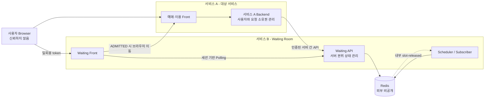
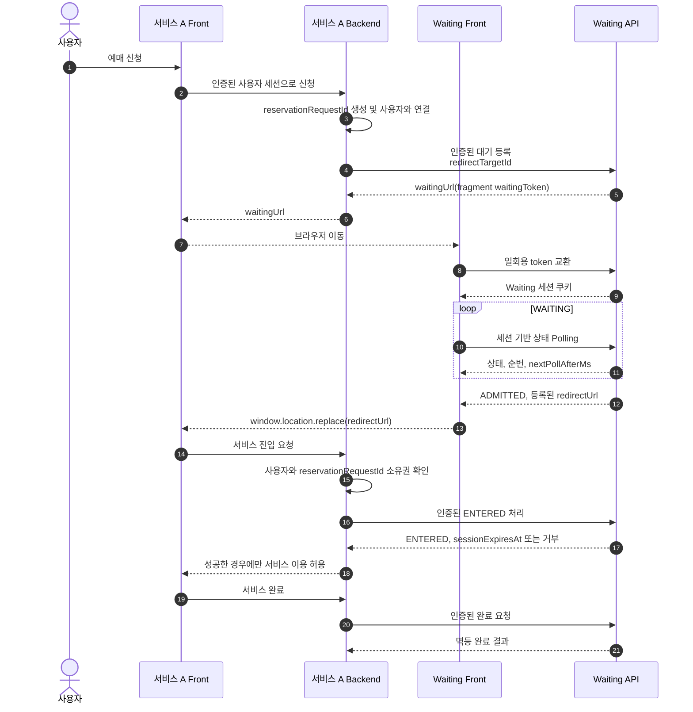

# Waiting Room 운영 보안 설계

- 상태: 향후 운영 적용을 위한 확정 설계(Backend 보안 기능은 아직 미구현)
- 적용 대상: 서비스 A와 Waiting Room 서비스 B
- 현재 구현 범위: 핵심 구조 구현 후 단계적으로 적용
- 관련 구조: `docs/waiting-room-architecture.md`

## 1. 목적과 경계

이 문서는 Waiting Room을 여러 대상 서비스에 연동할 수 있는 운영 솔루션으로 배포할 때 필요한 보안 경계를 정의한다.

- **서비스 A - 대상 서비스**: 예매 신청, 사용자·세션 관리, 실제 서비스 이용과 완료 처리
- **서비스 B - Waiting Room**: 대기 상태, 입장 허용과 활성 슬롯 관리

Waiting Front는 상태를 Polling하고 `ADMITTED` 응답을 받으면 `window.location.replace(redirectUrl)`로 서비스 A에 이동한다. Waiting 서버가 Browser를 직접 redirect하거나 별도 입장 서비스에 통보하지 않는다.

## 2. 보안 원칙

1. `reservationRequestId`는 업무 식별자이지 입장권이나 Browser 인증정보가 아니다.
2. Browser의 최초 Waiting 접근에는 짧은 수명의 일회용 `waitingToken`을 사용한다.
3. 서비스 A Backend만 대기 등록, token 재발급, 입장, 완료와 취소 API를 호출할 수 있다.
4. Browser가 제출한 상태, 순번, `redirectUrl`, `serviceId` 또는 입장 여부를 신뢰하지 않는다.
5. 서비스 A는 돌아온 Browser의 사용자·세션과 `reservationRequestId` 소유 관계를 확인한다.
6. 서비스 B는 인증된 서버 간 요청으로 `ADMITTED → ENTERED`를 처리한다.
7. TLS, Backend 인증과 사용자 입장 검증은 서로 다른 책임이며 하나로 대체하지 않는다.
8. 보안 상태를 검증할 수 없으면 입장을 허용하지 않는 fail-closed를 기본으로 한다.
9. 한 Browser에서는 Waiting origin의 고정 쿠키로 활성 Waiting 세션 하나만 유지하며 새 요청을 시작하면 기존 Waiting 화면과 세션을 교체한다.

## 3. 신뢰 경계



Browser는 신뢰 경계 밖에 있다. Redis, 내부 Pub/Sub, Scheduler와 관리 API는 외부 네트워크에 노출하지 않는다.

## 4. 전송 및 Backend 인증

### 4.1 전송 보안

- 모든 외부·내부 HTTP 통신에 HTTPS를 사용한다.
- 운영 환경에서 HSTS와 안전한 TLS 설정을 적용한다.
- TLS는 통신 기밀성과 서버 신원을 보호하지만 호출 Backend의 업무 권한까지 증명하지 않는다.

### 4.2 초기 Backend 인증

초기 연동은 서비스별 API Key를 다음 Header로 전달한다.

```http
Authorization: ApiKey {keyId}.{secret}
```

- 서비스별로 서로 다른 키를 발급한다.
- Browser, URL, Frontend bundle, 로그와 오류 메시지에 키를 노출하지 않는다.
- 서비스 A는 Secret Manager 또는 배포 환경의 비밀 저장소에서 키를 주입한다.
- 키에는 허용 `serviceId`, scope, 만료시각, 마지막 사용시각과 상태를 둔다.
- 현재 키와 다음 키를 제한된 기간 함께 허용해 무중단 교체한다.
- 유출 시 해당 서비스 키만 즉시 폐기한다.

Waiting 서비스는 다음 정보만 저장한다.

```text
keyId
HMAC-SHA-256(key=serverPepper, message=secret)
serviceId
scopes
expiresAt
lastUsedAt
status
```

원문 secret은 저장하지 않는다. server pepper는 API Key 데이터와 분리된 비밀 저장소에 보관하고, 검증값은 상수시간 비교를 사용한다.

기본 scope는 다음과 같다.

```text
waiting:create
waiting:token:issue
waiting:enter
waiting:complete
waiting:cancel
```

API Key 단독 인증은 초기 호환 방식이다. 고가치 거래, 외부 고객 확대 또는 키 유출 영향이 커지는 시점에는 OAuth 2.0 client credentials와 `private_key_jwt` 또는 mTLS를 우선 적용한다.

### 4.3 Source IP/CIDR

Source CIDR allowlist는 추가 제한으로만 사용한다. NAT, Proxy, Cloud IP 변경과 장애 전환 때문에 단독 인증 수단으로 사용하지 않는다.

## 5. Waiting Browser 세션

### 5.1 일회용 token

서비스 A Backend가 대기를 등록하면 Waiting 서비스가 5분 TTL의 고엔트로피 `waitingToken`을 발급한다.

- token은 CSPRNG로 생성하고 최소 128-bit entropy를 가진다.
- Redis에는 token 원문 대신 검증용 hash를 저장한다.
- token Key는 `waiting-access:{serviceId}:{tokenHash}` 형식으로 구성해 동일 서비스의 원자 등록 Key와 같은 Redis hash slot을 사용한다.
- token은 최초 Waiting 접근에서 원자적으로 한 번만 소비한다.
- `WAITING`은 최대 대기시간이 유효하고 heartbeat가 유효하거나 복구 barrier가 활성일 때, `ADMITTED`는 활성 슬롯이 만료 전일 때만 token을 세션으로 교환한다.
- 시간상 이미 만료된 요청은 token 발급 또는 소비와 같은 원자 처리에서 `EXPIRED`로 정리하고 token 사용을 거부한다.
- token이 만료되거나 이미 소비됐으면 Waiting 세션을 만들지 않는다.
- token은 상태 조회나 실제 서비스 입장권으로 재사용하지 않는다.
- `waitingUrl`은 공개 `serviceId`만 query에 두고 token은 URL fragment에 둔다. fragment는 HTTP 요청과 Referer에 포함되지 않으며 Waiting Front가 읽은 즉시 제거한다.

### 5.2 세션 쿠키

token 교환에 성공하면 서버가 Waiting 세션 쿠키를 발급한다.

- 쿠키 이름은 `__Host-waiting_session`으로 고정하고 `Secure`, `HttpOnly`, `SameSite=Strict`, `Path=/`를 적용하며 `Domain`은 설정하지 않는다.
- 쿠키는 Browser 종료 시 제거되는 non-persistent cookie로 발급하고, 서버 세션 만료 시 과거 시각의 `Expires`로 명시적으로 삭제한다.
- 쿠키 값은 공개 routing 값인 `serviceId`와 최소 128-bit entropy를 가진 CSPRNG 세션 secret으로 구성한다.
- 서버 세션에는 `serviceId`, `reservationRequestId`, `waitingSessionVersion`, 생성·만료시각을 연결한다.
- Redis 세션 Key는 `waiting-session:{serviceId}:{sessionHash}`로 구성하고, 쿠키 원문 대신 세션 secret의 hash를 사용한다.
- 쿠키의 `serviceId`는 Key 조회 범위만 정하며, 서버 세션에 저장된 값과 일치해야 한다.
- Polling은 session hash와 `waitingSessionVersion`이 요청 상태의 현재 값과 모두 일치할 때만 허용한다.
- Polling은 URL ID가 아니라 Waiting 세션에서 요청을 찾는다.

token 교환 후 Front는 `history.replaceState()`로 fragment를 제거한다. 다음 Header를 Waiting 페이지와 상태 응답에 적용한다.

```http
Referrer-Policy: no-referrer
Cache-Control: no-store
Content-Security-Policy: default-src 'self'; frame-ancestors 'none'; base-uri 'none'; form-action 'self'
X-Content-Type-Options: nosniff
X-Frame-Options: DENY
```

Proxy, access log, 분석 도구와 오류 메시지에서 `waitingToken`, Waiting 세션 ID와 query를 masking한다. Waiting Front의 분석 도구에는 fragment와 token 교환 body를 전달하지 않는다.

token 교환 요청의 `serviceId`는 hash slot과 token Key를 선택하기 위한 공개 routing 값일 뿐 인증정보가 아니다. Waiting API는 token 레코드에 저장된 `serviceId`와 일치하는지 확인하고, token 검증 전에는 요청 상태를 반환하지 않는다.

### 5.3 Browser origin과 요청 검증

초기 배포에서는 Waiting Front와 Waiting API를 동일 origin으로 제공한다.

- 임의 origin CORS는 허용하지 않는다.
- token 교환 요청은 정확히 일치하는 `Origin`을 필수로 검사하고 `null` 또는 없는 Origin을 거부한다. Fetch Metadata가 있으면 `Sec-Fetch-Site: same-origin`도 확인한다.
- 상태 Polling은 same-origin cookie와 `X-Waiting-Request: 1` Header를 사용한다. `Sec-Fetch-Site`가 있으면 `same-origin`만 허용하고, `Origin`이 있으면 Waiting origin과 정확히 일치해야 한다.
- Front/API 분리 배포는 초기 구현 범위에서 제외한다. 추후 지원할 때는 정확한 Front origin의 credentialed CORS, preflight, CSRF token의 발급·전달·검증 계약을 별도 설계한 뒤 활성화하며 wildcard와 `null` origin은 허용하지 않는다.

### 5.4 복귀와 다중 탭

- 서비스 A는 자신의 로그인 또는 익명 Browser 세션별로 현재 `reservationRequestId` 하나를 저장한다. DB transaction, compare-and-set 또는 unique constraint로 교체를 직렬화하고 승자 한 요청만 Waiting Room에 등록한다.
- Waiting origin의 고정 `__Host-waiting_session` 쿠키는 Browser 전체에서 하나이므로 가장 최근 Waiting 세션만 유지한다. 같은 서비스 A의 이전 요청은 먼저 취소하고, 서비스 간 조정이 불가능한 이전 요청은 cookie 교체 후 heartbeat timeout으로 정리한다.
- 같은 요청을 새로고침하거나 새 탭으로 열면 기존 Waiting 세션을 공유한다. 여러 탭이 동시에 Polling하지 않도록 `BroadcastChannel` 또는 동등한 Browser 조정 수단으로 한 탭만 주기 Polling을 수행하고 결과를 공유한다.
- 새 요청으로 교체된 기존 요청은 서비스 A가 취소한다. 취소 통보가 실패하면 heartbeat timeout으로 정리한다.
- 쿠키가 삭제됐거나 다른 Browser에서 접근하면 서비스 A Backend를 통해 token을 새로 발급받는다.
- token 재발급은 해당 서비스가 소유하고 최대 대기시간이 유효하며 heartbeat가 유효하거나 복구 barrier가 활성인 `WAITING`, 또는 활성 슬롯 만료 전 `ADMITTED` 요청에만 허용한다.
- 한 요청에는 가장 최근에 발급한 token과 Waiting 세션 하나만 유효하다. 재발급 시 이전 token과 현재 세션 Key를 폐기하고 `waitingSessionVersion`을 증가시킨다. Polling 시 version이 다르면 heartbeat를 갱신하지 않고 거부한다.
- 동시에 token을 교환하면 원자 소비에 성공한 한 요청만 세션을 얻는다.

## 6. Redirect 정책

서비스 A가 요청마다 전체 URL을 보내지 않고, 사전에 등록된 `redirectTargetId`를 사용한다.

```text
serviceId: reservation-service
redirectTargetId: service-entry
registered URI: https://service-a.example.com/service-entry
```

- 등록된 HTTPS absolute URI 전체 문자열과 exact match한다. URI에는 userinfo와 fragment를 허용하지 않는다.
- wildcard domain, prefix 문자열 비교와 임의 `next` 또는 `returnUrl`을 허용하지 않는다.
- Waiting 서비스가 등록 URI를 선택하고 허용된 query만 서버에서 생성한다.
- `reservationRequestId`를 query로 추가할 수 있지만 서비스 A는 이를 인증정보로 신뢰하지 않는다.
- 서비스 A callback이 후속 이동을 지원한다면 상대 경로나 별도 목적지 allowlist만 허용한다.

서비스 A callback은 다음 인증 계약 중 하나를 사용한다.

- Waiting Room과 서비스 A가 같은 site이면 기존 서비스 A 로그인 세션으로 사용자와 요청 소유권을 확인한다.
- 서로 다른 site이면 top-level callback에 필요한 서비스 A 인증 쿠키의 `SameSite` 정책을 명시적으로 설정한다. `Strict` 쿠키만으로 callback 인증이 불가능한 배포에서는 서버가 발급·소비하는 짧은 수명의 일회용 handoff token을 별도 연동 계약으로 사용한다.
- 어떤 방식에서도 query의 `reservationRequestId` 자체를 인증정보로 사용하지 않는다.

Waiting Front는 서버가 `ADMITTED` 응답에 반환한 URL만 사용한다. Browser 입력으로 목적지를 변경하지 않는다.

## 7. 대기부터 완료까지의 보안 흐름



서비스 A callback은 query의 `reservationRequestId`만 보고 사용자를 입장시키지 않는다. 신청 시 저장한 서버 측 거래 레코드와 현재 로그인 사용자 또는 세션이 일치해야 한다.

## 8. API별 접근 정책

| API | 호출 주체 | 필수 검증 |
|---|---|---|
| `POST /api/v1/waiting-requests` | 서비스 A Backend | Backend 인증, `waiting:create`, service 소유권, Idempotency-Key, redirect target |
| `POST /api/v1/waiting-requests/{id}/access-tokens` | 서비스 A Backend | Backend 인증, `waiting:token:issue`, 소유권, 최대 대기시간이 유효하고 heartbeat가 유효하거나 복구 barrier가 활성인 `WAITING`, 또는 활성 슬롯 만료 전 `ADMITTED` |
| `POST /api/v1/waiting-session` | Browser | 동일 origin, 일회용 token, 시간상 유효한 허용 상태, 원자 소비, rate limit |
| `GET /api/v1/waiting-session` | Waiting Front | Waiting 세션, 현재 session version, `X-Waiting-Request`, same-origin Fetch Metadata·Origin, rate limit |
| `POST /api/v1/waiting-requests/{id}/enter` | 서비스 A Backend | Backend 인증, `waiting:enter`, 소유권, `ADMITTED`, 활성 슬롯 |
| `POST /api/v1/waiting-requests/{id}/complete` | 서비스 A Backend | Backend 인증, `waiting:complete`, 소유권, 이전 `ENTERED`, 멱등 처리 |
| `POST /api/v1/waiting-requests/{id}/cancel` | 서비스 A Backend | Backend 인증, `waiting:cancel`, 소유권, 허용 상태 |

Backend API의 저장소 조회와 변경 조건에는 인증된 `serviceId`와 `reservationRequestId`를 함께 사용한다. Body나 query의 `serviceId`만으로 소유권을 선택하지 않는다.

## 9. PKCE 적용 기준

현재 기본 흐름에는 PKCE와 별도의 `admission_code`를 추가하지 않는다.

PKCE는 OAuth authorization code 탈취를 방지하는 메커니즘이며 `reservationRequestId` 또는 Waiting URL 노출을 직접 해결하지 않는다. 현재 대체 통제는 다음과 같다.

- 일회용 `waitingToken`과 Waiting 세션
- 서비스 A Backend 인증
- 서비스 A의 사용자·요청 소유권 검증
- 서비스 B의 원자적 `ADMITTED → ENTERED`
- 성공한 서버 간 응답 이후에만 실제 서비스 이용 허용

다음 조건이 생기면 PKCE S256과 짧은 수명의 일회용 입장 코드를 함께 도입한다.

- 예매 신청과 실제 이용 서비스가 분리된다.
- 제3자 또는 공개 클라이언트가 입장 결과를 교환한다.
- Browser만으로 입장 권한을 전달해야 한다.
- 교차 기기 또는 애플리케이션 handoff가 필요하다.

이 경우 `code_verifier`는 Browser 세션에 보관하고, `code_challenge`, 일회용 code, client와 callback을 서버 측 거래에 함께 연결한다.

## 10. Redis 보안과 Pub/Sub

- Redis는 Private network에 두고 인터넷에 노출하지 않는다.
- TLS와 인증을 활성화한다.
- 운영 Redis는 `maxmemory-policy noeviction`을 사용해 일부 Key가 조용히 축출되는 것을 막는다. 이 설정은 Lua 오류의 rollback이나 OOM 이후 정합성을 보장하지 않는다.
- `requestTtl`, 등록 rate limit과 Key 최대 크기로 최악 메모리를 산정하고 상태 전이·격리용 headroom을 남긴다. 경고 임계값에서는 증설 경보를, 차단 임계값에서는 신규 등록 `503`을 적용한다. 모든 변경 Lua는 사전 생성된 서비스별 `writes-enabled:{serviceId}` gate를 첫 쓰기 전에 확인한다.
- Waiting 애플리케이션 전용 Redis user를 사용한다.
- Key pattern은 Waiting Room namespace만 허용한다.
- Pub/Sub channel은 Redis 6.2 이상의 `&channel-pattern` ACL로 제한하고 `allchannels`를 허용하지 않는다.
- `resetchannels` 이후 `waiting-room:slot-released:*`만 허용한다.
- 위험한 관리·전체 탐색 명령은 애플리케이션 계정에서 거부한다.

Redis Pub/Sub은 at-most-once이므로 권위 상태로 사용하지 않는다. 요청 상태와 슬롯은 Redis Key가 원본이며 Scheduler가 이벤트 유실을 보정한다.

## 11. 주요 위협과 통제

| 위협 | 통제 |
|---|---|
| Waiting Room 우회 | 서비스 A Backend의 서버 측 `enter` 확인, 보호 endpoint 공통 검증 |
| Waiting URL 탈취 | fragment의 일회용 token, 짧은 TTL, 원자 세션 교환, 즉시 fragment 제거, no-referrer, no-store |
| 이전 Waiting 세션 재사용 | 요청 상태의 현재 session hash와 version 검증, token 재발급 시 이전 세션 폐기 |
| same-site origin의 Polling 유발 | custom Header, same-origin Fetch Metadata·Origin 검증, credentialed CORS 미허용 |
| 임의 `reservationRequestId` 사용 | 서비스 A의 사용자 소유권 확인, 서비스 B의 `serviceId` 결합 조회 |
| 상태 위조 | Redis의 서버 권위 상태만 신뢰, Browser 상태 입력 무시 |
| Redirect 변조 | 등록된 target ID, exact URI registry, 서버 생성 query |
| 다른 서비스 요청 접근 | 인증된 `serviceId`와 객체 ID를 모든 조건에 함께 사용 |
| API Key 탈취 | 서비스별 키, 최소 scope, 만료, 교체, 즉시 폐기, 비대칭 인증 전환 |
| 완료·입장 replay | 원자 상태 전이, 멱등 처리, 완료 요청 재활성화 차단 |
| 대기열 오염과 봇 | 서비스·IP·Waiting 세션별 rate limit과 quota |
| Redis 장애 중 잘못된 입장 | fail-closed, `503`과 `Retry-After` |
| Redis 일부 Key eviction | `noeviction`, 메모리 임계 경보, OOM fail-closed |
| 로그를 통한 비밀 유출 | 민감 Header·token·query masking, 식별자 축약 또는 hash |
| Waiting Front XSS·framing | 최소 권한 CSP, `frame-ancestors 'none'`, `X-Frame-Options: DENY`, 출력 인코딩과 의존성 점검 |

## 12. 상태 전이 보안

상태 전이와 슬롯 변경은 동일한 Redis Lua script에서 처리한다.

Redis Lua의 단일 실행은 다른 명령과 끼어들지 않지만 실행 중 오류 이전의 쓰기를 롤백하지 않는다. 모든 script는 공유 Key type과 입력을 첫 쓰기 전에 검증한다. batch 처리에서는 개별 상태 JSON의 decode 오류를 보호된 방식으로 처리하고 원문을 짧은 TTL의 격리 Key에 보관한다. 대기 요청은 `EXPIRED`, `STATE_CORRUPTED`로 종료하고, 활성 슬롯은 원래 score 만료 전까지 보존한 뒤 같은 종료 상태로 정리해 실제 이용 중인 사용자를 조기에 제거하지 않는다.

- `WAITING → ADMITTED`: Waiting 서비스 내부 Scheduler만 수행한다.
- `ADMITTED → ENTERED`: 해당 요청을 소유한 인증된 서비스 A만 수행한다.
- `WAITING 또는 ADMITTED → CANCELLED`: 해당 요청을 소유한 인증된 서비스 A만 수행한다.
- `ENTERED` 완료: 해당 요청을 소유한 서비스 A만 슬롯을 반환할 수 있다.
- `EXPIRED`: Waiting 서비스의 만료 처리만 수행한다.

허용되지 않은 상태 전이는 `409 Conflict`로 처리하고, 인증·소유권 실패는 내부 객체 존재 여부를 노출하지 않는다.

## 13. 속도 제한과 자원 보호

다음 단위로 한도를 둔다.

- 전체 시스템
- 인증된 `serviceId`와 API Key
- endpoint와 scope
- Source IP
- Waiting Browser 세션
- 일회용 token 교환 실패

서버는 기본 조회 주기에 jitter를 적용한 최종 `nextPollAfterMs`와 동일한 `nextPollAllowedAt`을 Waiting 세션에 저장한다. Front는 반환값에 jitter를 다시 적용하지 않는다. 상태 Polling이 `nextPollAllowedAt`보다 빠르면 heartbeat를 갱신하지 않고 `429 Too Many Requests`를 반환한다. 복구 barrier가 비활성일 때 `Retry-After`는 초 단위로 올림한 `nextPollAllowedAt - now`, `maxRetryAfter`, 현재 요청의 남은 heartbeat 시간에서 safety margin을 뺀 값 중 가장 작은 값으로 계산하고 최소 1초를 보장한다. 남은 heartbeat가 safety margin 이하이면 원자적으로 `EXPIRED` 처리하고 종료 상태를 반환한다. barrier가 활성인 동안에는 heartbeat 부족만으로 만료시키지 않으며, heartbeat 조건을 제외한 같은 계산식을 사용한다. 요청 본문 크기, URL 길이, 동시 요청, Lua 조회 후보와 처리 batch도 제한한다.

## 14. 비밀과 감사 로그

### 기록 대상

- 서비스와 redirect target 등록·변경
- API Key 생성·교체·폐기와 마지막 사용
- Backend 인증 성공과 실패
- Waiting token 발급·소비·실패
- 대기 등록, 입장, 완료, 취소와 만료 결과
- rate limit과 quota 차단
- 운영자 설정 변경

### 기록 금지 대상

- API Key와 waitingToken 원문
- Authorization Header와 세션 쿠키
- 개인키 또는 access token 원문
- URL query 전체
- 불필요한 개인정보

감사에 필요한 식별자는 축약하거나 별도 salt를 사용한 단방향 hash로 기록한다.

`STATE_CORRUPTED`는 최초 1건부터 보안·운영 오류 지표, 격리 Key 식별자와 trace ID를 남기고 즉시 경보한다. 손상된 원문 자체는 일반 로그에 기록하지 않는다.

## 15. 운영 실패 원칙

- Backend 인증, scope, 서비스 소유권, redirect target 또는 상태 검증에 실패하면 입장을 거부한다.
- 저장소 장애로 상태와 슬롯을 확인할 수 없으면 입장을 허용하지 않는다.
- 예상 밖 Redis OOM을 `redis.pcall`로 감지한 script는 서비스별 `writes-enabled` gate를 삭제한다. 모든 AP, Scheduler와 Subscriber가 같은 gate를 확인하므로 후속 변경을 `503`으로 차단한다.
- break-glass 계정의 복구 도구만 별도 `recovery-lease`를 획득한다. 오류 결과의 영향 ID를 우선 검사하고, 영향 ID를 얻지 못하면 해당 `serviceId`의 요청 상태 Key와 대기·heartbeat·활성 슬롯 member 전체를 cursor scan으로 대조한다. 메모리 확보와 정합성 검증이 끝난 뒤 단일 복구 소유자만 gate를 다시 생성한다. 애플리케이션은 gate를 임의 복원하거나 실패 script를 맹목 재시도하지 않는다.
- 애플리케이션 시작 또는 Redis 연결 단절 시 readiness를 닫는다. 연결 복구 후 bootstrap Lua가 공유 유지보수 heartbeat와 기존 barrier를 확인해 필요한 `recoveryId`와 barrier를 원자적으로 확정한 뒤에만 readiness를 연다. 다른 정상 인스턴스의 유지보수 heartbeat가 있으면 scale-out만으로 barrier를 만들거나 연장하지 않는다. barrier 시각 전에는 heartbeat timeout을 적용하지 않지만 최대 대기시간과 활성 슬롯 만료는 계속 적용한다.
- Scheduler와 Pub/Sub Subscriber는 서비스별 Redis lease를 획득한 한 인스턴스만 유지보수 Lua를 실행한다.
- 외부 응답에는 상세 인증 실패 이유 대신 추적 ID를 제공한다.
- 재시도 가능한 요청은 동일한 `reservationRequestId`와 payload로 수행한다.
- 장애 우회 모드는 명시적 운영 승인, 제한 시간과 감사 로그 없이 사용하지 않는다.

## 16. 단계적 적용

### 1단계 - 초기 운영

- HTTPS와 HSTS
- 서비스별 API Key, scope, HMAC 검증값, 교체·폐기
- 일회용 waitingToken과 Waiting 세션
- Waiting session hash·version 검증과 재발급 시 이전 세션 폐기
- exact redirect target registry
- 서비스 A의 사용자·요청 소유권 확인
- Polling custom Header·same-origin 검증, rate limit, no-referrer, no-store
- `__Host-` 세션 쿠키와 Waiting Front CSP
- 서버 간 `enter`, `complete`, `cancel` 검증
- Redis `noeviction`, 메모리 경보, ACL과 비밀 masking
- 서비스별 변경 gate와 break-glass 정합성 복구
- Redis 복구 readiness gate와 heartbeat 만료 barrier

### 2단계 - 범용 운영 강화

- OAuth 2.0 client credentials와 `private_key_jwt`
- 서비스별 quota와 키 자동 교체
- 운영자 RBAC와 보안 경보
- 테넌트 격리 자동 검증
- API Gateway 통합

### 3단계 - 고신뢰 연동

- mTLS 또는 sender-constrained token
- Origin 직접 접근 차단
- KMS/HSM 통합
- 필요 시 PKCE와 일회용 admission code

`private_key_jwt` 도입 시 `iss`, `sub=client_id`, `aud`, `exp`, 전자서명과 `jti` replay를 검증한다.

## 17. 운영 보안 완료 기준

1. 등록되지 않은 Backend가 대기 요청을 만들 수 없다.
2. 한 서비스 자격 증명으로 다른 서비스 요청을 조회하거나 변경할 수 없다.
3. Waiting token이 한 번만 소비되고 URL ID만으로 상태를 조회할 수 없다.
4. URL의 `reservationRequestId`만 바꿔 서비스 A에 입장할 수 없다.
5. 서비스 A의 `enter` 검증에 성공하고 `completedAt`이 없으며 활성 이용시간 안에 있는 `ENTERED` 요청만 보호 기능에 접근할 수 있다.
6. 동일 입장·완료 요청을 반복해도 상태와 슬롯이 한 번만 변경된다.
7. 등록되지 않은 목적지로 이동할 수 없다.
8. API Key와 세션 정보가 Browser bundle, URL, 로그와 오류 응답에 노출되지 않고, waitingToken fragment가 HTTP 요청·Referer·서버 로그에 전송되지 않는다.
9. API Key를 무중단 교체하고 유출 키를 즉시 폐기할 수 있다.
10. Polling 남용과 대기열 등록 폭주가 서비스별·세션별 제한으로 차단된다.
11. Redis 장애 시 검증되지 않은 입장이 허용되지 않는다.
12. Redis 복구 후 공유 barrier가 끝나기 전에는 heartbeat timeout으로 정상 요청을 만료시키지 않는다.
13. 손상된 개별 상태 데이터가 batch 전체의 부분 변경을 유발하지 않고 격리·경보된다.
14. 한 Browser에서는 고정 Waiting cookie가 가리키는 가장 최근 Waiting 세션 하나만 유지된다.
15. token 재발급 후 이전 Waiting 세션으로 상태 조회나 heartbeat 갱신을 할 수 없다.
16. Redis 복구 barrier가 확정되기 전에는 Polling과 상태 변경 요청을 받지 않는다.
17. 운영 Redis의 eviction으로 요청 상태와 ZSET 일부만 제거되지 않는다.
18. Redis OOM 시 서비스 변경 gate가 내려가 모든 AP·Scheduler·Subscriber의 후속 쓰기가 차단된다.
19. 영향 ID를 알 수 없는 OOM은 해당 서비스 전체를 검사하고 단일 복구 소유자가 검증을 마치기 전에는 변경 gate가 다시 생성되지 않는다.

## 18. 참고 표준과 자료

- [RFC 7636: Proof Key for Code Exchange](https://www.rfc-editor.org/rfc/rfc7636.html)
- [RFC 7523: JWT Profile for OAuth Client Authentication](https://www.rfc-editor.org/rfc/rfc7523.html)
- [RFC 8705: OAuth Mutual TLS Client Authentication](https://www.rfc-editor.org/rfc/rfc8705.html)
- [RFC 9700: OAuth 2.0 Security Best Current Practice](https://www.rfc-editor.org/rfc/rfc9700.html)
- [OWASP API Security Top 10](https://owasp.org/API-Security/)
- [OWASP REST Security Cheat Sheet](https://cheatsheetseries.owasp.org/cheatsheets/REST_Security_Cheat_Sheet.html)
- [OWASP Session Management Cheat Sheet](https://cheatsheetseries.owasp.org/cheatsheets/Session_Management_Cheat_Sheet.html)
- [OWASP Secrets Management Cheat Sheet](https://cheatsheetseries.owasp.org/cheatsheets/Secrets_Management_Cheat_Sheet.html)
- [Redis Pub/Sub](https://redis.io/docs/latest/develop/pubsub/)
- [Redis ACL](https://redis.io/docs/latest/operate/oss_and_stack/management/security/acl/)
