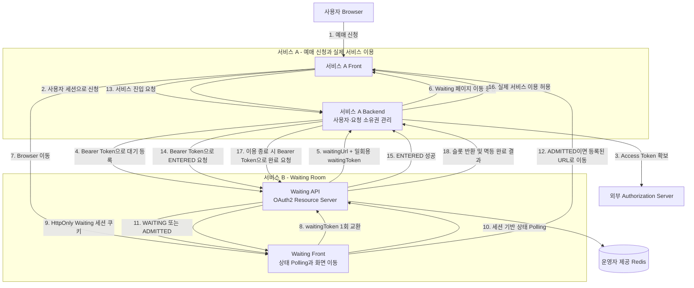
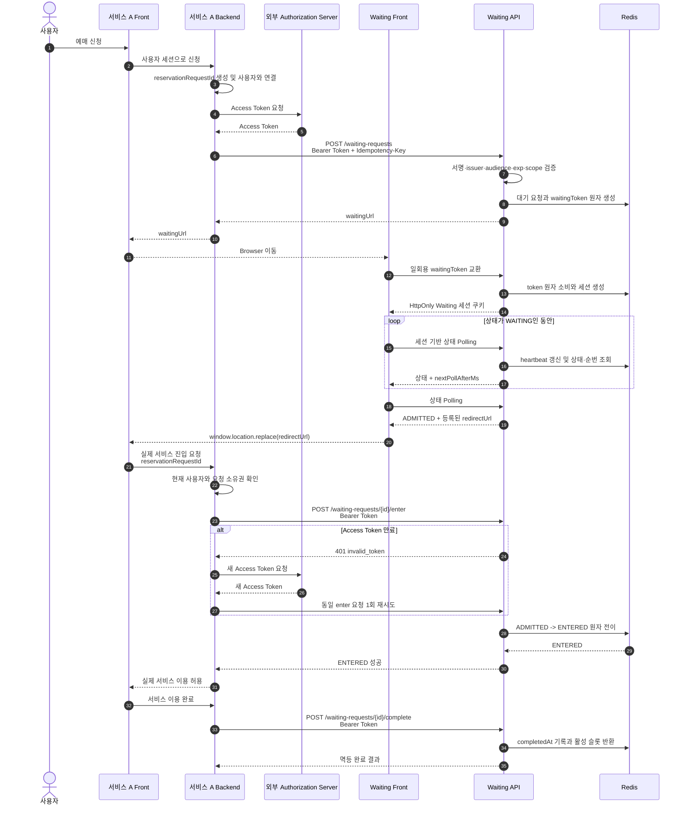

# Waiting Room 운영 보안 설계

- 문서 대상: Waiting Room을 연동·배포·운영하는 개발자
- 적용 대상: 서비스 A와 Waiting Room 서비스 B
- 관련 구조: `docs/waiting-room-architecture.md`

## 1. 목적과 시스템 경계

이 문서는 Waiting Room을 외부 서비스에 연동할 때 필요한 인증·인가와 Browser 대기 세션의 보안 경계를 정의한다.

- **서비스 A - 대상 서비스**: 예매 신청, 사용자·세션 관리, 실제 서비스 이용과 완료 처리
- **서비스 B - Waiting Room**: 대기 등록, 상태 조회, 입장 허용과 활성 슬롯 관리
- **Authorization Server**: 서비스 A에 OAuth2 Access Token을 발급하는 외부 시스템
- **Browser**: 서비스 A Front와 Waiting Front를 실행하지만 신뢰하지 않는 외부 영역
- **Redis**: Waiting Room 내부 상태 저장소이며 외부에 공개하지 않음

Waiting Room은 OAuth2를 활성화하면 Resource Server로 동작하고, 비활성화하면 Backend API 인증을 상위 인프라에 위임하는 `UPSTREAM_MANAGED` 모드로 동작한다. Access Token의 발급·갱신과 서비스 A의 Client 인증 방식은 Waiting Room의 책임이 아니다.

서비스 A의 신청 화면과 실제 이용 화면은 같은 서비스에 속한다. Waiting Front는 상태를 Polling하다가 `ADMITTED`가 되면 서비스 A의 등록된 복귀 URL로 Browser를 이동시킨다. Waiting 서버가 Browser를 직접 redirect하거나 서비스 A에 별도 입장 통보를 보내지는 않는다.

이미 입장한 세션이 `ENTERED`로 조회되는 경우에도 등록된 동일 복귀 URL을 반환하고 Front는 그 URL로 이동한다.

## 2. 인증 경계

Waiting Room 보안은 서로 다른 두 인증 경로로 구성한다.

1. **서비스 A Backend → Waiting API**: OAuth2 활성화 시 외부 Authorization Server가 발급한 JWT Access Token을 검증하고, `UPSTREAM_MANAGED` 모드에서는 API Gateway 또는 private network가 접근을 통제한다.
2. **Browser → Waiting API**: 일회용 `waitingToken`을 Waiting 세션 쿠키로 교환한 뒤 세션 기반으로 Polling한다.

Backend용 Access Token을 Browser에 전달하지 않고, Waiting 세션 쿠키를 Backend API 인증에 사용하지 않는다.

`reservationRequestId`는 업무 식별자일 뿐 인증정보가 아니다. 이 값만 아는 사용자는 대기 상태를 조회하거나 입장·완료 상태를 변경할 수 없어야 한다.

## 3. 전체 보안 흐름

다음 흐름은 OAuth2를 활성화한 배포를 나타낸다. `UPSTREAM_MANAGED` 모드에서는 Access Token 확보·검증 단계가 API Gateway 또는 private network의 접근 통제로 대체되고 Waiting Room의 대기·세션·입장 상태 흐름은 동일하다.



핵심은 Browser가 `ADMITTED` 응답을 받았다는 사실만으로 실제 서비스에 입장하지 못한다는 점이다. 서비스 A Backend가 사용자와 `reservationRequestId`의 소유 관계를 확인하고, 유효한 Access Token으로 `ENTERED` API 호출에 성공한 경우에만 실제 기능을 허용한다.

## 4. 상세 시퀀스



정상 완료 후 요청의 상태값은 `ENTERED`로 유지하고 `completedAt`을 기록한다. 활성 슬롯에서만 제거하므로 이미 완료된 요청을 다시 활성화하지 않는다.

## 5. OAuth2 Resource Server

### 5.1 지원 범위

Waiting Room은 외부 Authorization Server가 발급한 **JWT Access Token**을 지원한다. 다음 기능은 Waiting Room의 지원 범위에 포함되지 않는다.

- Access Token 발급 또는 갱신
- Authorization Server 역할
- 외부 서비스의 Client 등록 또는 Client 인증
- Refresh Token 저장 또는 처리
- Opaque Token introspection

### 5.2 JWT 검증

Waiting API는 사전에 설정된 issuer와 audience를 기준으로 다음을 검증한다.

1. 초기 허용 알고리즘인 `RS256`과 JWKS 공개키를 사용한 전자서명
2. `iss`가 설정된 issuer와 정확히 일치하는지
3. `aud`에 설정된 Waiting API audience가 포함되는지
4. `exp`가 지나지 않았는지
5. `nbf`가 있다면 사용 가능한 시각인지
6. endpoint에 필요한 `scope`가 있는지
7. JWT의 `client_id` claim이 요청의 `serviceId`를 소유하는지

JWT Header와 claim은 서명 검증이 끝난 뒤에만 신뢰한다. Access Token 원문은 저장하거나 로그에 기록하지 않는다.

Client 식별자는 대소문자를 구분하는 문자열 `client_id` claim으로 고정한다. `client_id`가 없거나 문자열이 아니면 token을 거부하며 `sub`, `azp` 등 다른 claim으로 대체하지 않는다.

### 5.3 운영 설정

```yaml
waiting-room:
  security:
    oauth2:
      enabled: ${WAITING_ROOM_OAUTH2_ENABLED:false}
    clients:
      reservation-service-client:
        services:
          - reservation-service
```

OAuth2를 사용하는 배포는 사용자 설정 파일에 issuer와 audience를 추가한다.

```yaml
spring:
  security:
    oauth2:
      resourceserver:
        jwt:
          issuer-uri: https://auth.example.com
          audiences:
            - waiting-room-api
```

`enabled=true`인 외부 인증 배포는 issuer와 audience가 필수이며 누락되면 기동하지 않는다. Decoder는 issuer discovery에서 JWKS 위치를 확인하므로 해당 endpoint와 공개키 endpoint에 접근할 수 있어야 한다. `WAITING_ROOM_OAUTH2_ISSUER_URI`와 `WAITING_ROOM_OAUTH2_AUDIENCE`로 기본 설정의 값을 주입할 수 있다.

`enabled=false`이면 Backend JWT 검증을 적용하지 않고 Backend API 인증을 API Gateway 또는 private network에 위임하는 `UPSTREAM_MANAGED` 모드로 동작한다. 이 모드에서는 Access Token, scope와 `client_id` 소유권을 검증하지 않는다. 애플리케이션은 기동 시 경고를 기록하고 `/actuator/info`의 `backendAuthentication`에 현재 인증 모드를 표시한다. health/readiness 응답의 `status`는 인증 모드와 별도로 확인한다.

OAuth2가 활성화된 경우 `client_id`와 `serviceId`의 소유 관계는 Waiting Room 설정으로 관리한다. 요청 body 또는 query의 `serviceId`만으로 소유권을 결정하지 않는다. `UPSTREAM_MANAGED` 모드에서는 등록된 `serviceId`인지에 대한 업무 검증만 수행하고 외부 접근 통제와 서비스별 권한은 운영자가 담당한다.

### 5.4 API별 scope

| API 기능 | 필수 scope |
|---|---|
| 대기 등록 | `waiting:create` |
| Waiting token 재발급 | `waiting:token:issue` |
| 입장 확정 | `waiting:enter` |
| 서비스 이용 완료 | `waiting:complete` |
| 대기 취소 | `waiting:cancel` |

Access Token이 없으면 `401 Unauthorized`와 `WWW-Authenticate: Bearer`를 반환한다. token이 잘못됐거나 만료되었으면 `401 Unauthorized`와 `WWW-Authenticate: Bearer error="invalid_token"`을 반환하되 만료시각과 세부 검증 실패 이유는 노출하지 않는다. 인증은 성공했지만 scope가 부족하면 `403 Forbidden`과 `WWW-Authenticate: Bearer error="insufficient_scope", scope="{requiredScope}"`를 반환한다. Security Filter의 오류는 공통 JSON body를 요구하지 않고 상태 코드와 challenge를 사용한다.

유효한 token의 `client_id`가 요청의 `serviceId`를 소유하지 않거나 요청 ID가 존재하지 않으면 객체 존재 여부를 숨기기 위해 모두 `404 Not Found`로 응답한다. Waiting 세션 인증 실패는 Bearer 오류 Header를 사용하지 않고 별도 `WAITING_SESSION_INVALID` 오류 코드로 구분한다.

### 5.5 Access Token 만료와 입장 재시도

대기 등록에 사용한 Access Token이 대기 중 만료되어도 대기 요청과 Waiting 세션은 유지한다. Access Token은 대기 요청의 수명을 나타내지 않고 각 Backend API 호출 권한만 증명한다.

서비스 A가 `enter` 또는 `complete`에 만료된 token을 보내면 Waiting API는 `401`을 반환한다. 서비스 A는 외부 Authorization Server에서 새 Access Token을 확보한 뒤 같은 `reservationRequestId`로 한 번 재시도한다.

- 새 token으로 `admissionExpiresAt` 이전에 `enter`하면 `ENTERED`로 전이한다.
- token을 다시 준비하는 동안 `ADMITTED` 요청의 `admissionExpiresAt`이 지나면 요청은 `EXPIRED`가 되고 입장을 거부한다.
- 인증 실패를 이유로 Waiting Room이 `ADMITTED` 입장 유효시간을 연장하지 않는다.
- 등록·입장·완료·취소 API는 재시도 시 중복 효과가 없도록 멱등 처리한다.

## 6. Browser Waiting 세션

### 6.1 일회용 waitingToken

서비스 A Backend가 대기를 등록하면 Waiting API가 기본 5분 TTL의 고엔트로피 `waitingToken`을 발급한다. TTL은 서비스별 `waiting-token-ttl`로 설정한다.

- token은 CSPRNG로 생성하고 최소 128-bit entropy를 가진다.
- Redis에는 token 원문 대신 검증용 hash를 저장한다.
- token은 `waitingUrl`의 fragment에 넣는다. fragment는 HTTP 요청과 Referer에 포함되지 않는다.
- Waiting Front는 fragment에서 token을 읽어 `POST /api/v1/waiting-session`으로 한 번만 교환한다.
- 교환과 token 소비, Waiting 세션 생성은 같은 Redis 원자 처리에서 수행한다.
- Front는 fragment를 읽은 즉시 `history.replaceState()`로 제거하고 교환 요청을 보낸다.
- token이 만료되거나 이미 소비됐으면 Waiting 세션을 만들지 않는다.

### 6.2 세션 쿠키

token 교환에 성공하면 서버가 Waiting 세션 쿠키를 발급한다.

- 쿠키 이름은 `__Host-waiting_session`으로 고정한다.
- `Secure`, `HttpOnly`, `SameSite=Strict`, `Path=/`를 적용하고 `Domain`은 설정하지 않는다.
- Redis에는 쿠키 원문 대신 세션 secret의 hash를 저장한다.
- Redis 세션 JSON은 `serviceId`, `reservationRequestId`, `version`, `nextPollAllowedAt`을 저장한다. 만료는 요청 상태 Key의 남은 TTL로 관리한다.
- Polling은 session hash와 현재 `waitingSessionVersion`이 모두 일치할 때만 허용한다.
- token 재발급 시 이전 token과 Waiting 세션을 폐기하고 version을 증가시킨다.
- 한 Browser에서는 고정 쿠키로 활성 Waiting 세션 하나만 유지한다.

### 6.3 Same-origin 검증

Waiting Front와 Waiting API는 단일 Docker 이미지에서 동일 origin으로 제공한다.

- 임의 origin CORS는 허용하지 않는다.
- token 교환과 Polling은 모두 `X-Waiting-Request: 1`, `Sec-Fetch-Site: same-origin`을 요구하고, `Origin`이 있으면 scheme·host·port의 일치를 검증한다.
- 상태 Polling은 세션 쿠키를 요구한다. same-origin Header 누락·불일치도 `401 WAITING_SESSION_INVALID`로 거부한다.
- 너무 빠른 Polling은 heartbeat를 갱신하지 않고 `429 Too Many Requests`를 반환한다.
- Waiting 페이지와 상태 응답에는 `Referrer-Policy: no-referrer`와 `Cache-Control: no-store`를 적용한다.

Backend Bearer API는 stateless로 처리하고 CSRF 검사 대상에서 제외할 수 있다. Waiting 세션 쿠키를 사용하는 Browser API는 같은 정책으로 전역 제외하지 않고 위 same-origin 검증을 유지한다.

## 7. Redirect와 실제 입장 검증

서비스 A는 대기 등록 시 사전에 설정된 `redirectTargetId`만 전달한다. Waiting API는 해당 ID에 등록된 URL을 선택하고 `reservationRequestId`만 query에 추가한다.

- wildcard domain, 문자열 prefix 비교와 Browser가 보낸 임의 URL을 허용하지 않는다.
- 운영 redirect target은 HTTPS absolute URI만 허용한다.
- `reservationRequestId`는 callback 대상을 찾는 공개 식별자이며 입장권이 아니다.
- 서비스 A Backend는 현재 사용자 세션과 신청 시 저장한 `reservationRequestId`의 소유 관계를 확인한다.
- 소유권 확인 후 유효한 Access Token으로 `enter`를 호출하고, Waiting API가 `ADMITTED → ENTERED` 전이에 성공한 경우에만 실제 서비스 이용을 허용한다.

## 8. API별 보안 계약

표의 Bearer JWT와 scope 검증은 OAuth2가 활성화된 경우에 적용한다. `UPSTREAM_MANAGED` 모드에서는 Backend API가 token 없이 호출되며, API Gateway 또는 private network가 동일한 접근 정책을 제공해야 한다. Browser Waiting 세션 검증은 OAuth2 설정과 관계없이 항상 적용한다.

| API | 호출 주체 | 인증과 필수 검증 |
|---|---|---|
| `POST /api/v1/waiting-requests` | 서비스 A Backend | Bearer JWT, `waiting:create`, client-service 소유권, Idempotency-Key, redirect target |
| `POST /api/v1/waiting-requests/{id}/access-tokens` | 서비스 A Backend | Bearer JWT, `waiting:token:issue`, 소유권, token 발급 가능 상태 |
| `POST /api/v1/waiting-session` | Waiting Front | same-origin, 일회용 waitingToken, 원자 소비 |
| `GET /api/v1/waiting-session` | Waiting Front | Waiting 세션 쿠키, session version, same-origin Header, rate limit |
| `POST /api/v1/waiting-requests/{id}/enter` | 서비스 A Backend | Bearer JWT, `waiting:enter`, 소유권, `ADMITTED`, 활성 슬롯 |
| `POST /api/v1/waiting-requests/{id}/complete` | 서비스 A Backend | Bearer JWT, `waiting:complete`, 소유권, `ENTERED`, 멱등 완료 |
| `POST /api/v1/waiting-requests/{id}/cancel` | 서비스 A Backend | Bearer JWT, `waiting:cancel`, 소유권, 취소 가능 상태 |

## 9. 개발·데모 JWT

데모는 외부 Authorization Server 없이 Resource Server 검증 흐름을 실행하기 위해 개발 전용 인증 시뮬레이터를 사용한다.

- `demo` profile과 `waiting-room.demo.jwt-enabled=true`가 모두 설정된 경우에만 임시 RSA key pair와 데모 JWT 발급 기능을 생성한다.
- `jwt-enabled=true`만으로는 다른 profile에서 기능이 활성화되지 않으며 `prod`와 `demo` profile을 함께 지정하면 기동을 실패시킨다.
- 애플리케이션을 재시작하면 key pair가 바뀌어 기존 데모 JWT가 무효화된다.
- 데모 JWT 기본 만료시간은 12시간으로 한다.
- token은 `iss=jn-waiting-room-demo`, `aud=waiting-room-api`, 데모 `client_id`와 모든 데모 scope를 포함한다.
- 데모 Front는 개발 전용 endpoint에서 token을 받아 메모리에만 보관하고 Backend용 API에 Bearer Header로 전송한다.
- 데모의 JWT 검증까지 활성화하려면 `WAITING_ROOM_OAUTH2_ENABLED=true`를 함께 설정한다. `jwt-enabled=true`만으로 Backend API 인증이 켜지지 않는다.
- 데모 발급 endpoint는 `POST /api/v1/demo/token`이며 `accessToken`, `expiresAt`과 `Cache-Control: no-store`를 반환한다. Front의 token 갱신은 `401`일 때 동일 요청에 한 번만 적용한다.
- 애플리케이션 시작 시 데모 데이터를 생성하지 않는다. 예매하기 클릭은 Bearer JWT의 `waiting:create` scope로 `POST /api/v1/demo/reset`을 호출하고, 초기 상태 생성이 완료된 204 응답 후 새 대기 신청을 보낸다.
- reset endpoint는 `demo` profile, `waiting-room.demo.seed-enabled=true`, `waiting-room.security.oauth2.enabled=true`를 모두 요구한다. OAuth2 OFF에서는 endpoint가 생성되지 않는다. token 누락·유효하지 않은 token은 401, scope 부족은 403이다. 일반 대기 신청 API는 데모 reset 책임을 갖지 않는다.
- reset은 대상 서비스의 기존 maintenance lease를 고유 토큰과 `heartbeatExpirationRecoveryGrace` 기간으로 획득하여 Scheduler와 다른 reset의 동시 변경을 차단한다. lease 획득 실패는 데이터 변경 전에 발생하며, 초기화 완료 또는 실패 시 자신의 토큰과 일치하는 lease만 해제한다.
- 단일 인스턴스의 한 데모 화면은 reset 완료 후 신규 신청을 보내며, 일반 등록 API와 독립적으로 수행되는 reset의 모든 교차 순서는 데모 계약에 포함하지 않는다. 일반 등록 API에 데모 전용 gate를 적용하지 않는다.
- 운영 profile에서는 데모 key, 발급 Bean과 endpoint를 생성하지 않는다.
- 운영 Front build에는 데모 route가 포함되지 않으며, 환경변수나 Frontend bundle에 개인키 또는 고정 JWT를 넣지 않는다.
- 데모 인증 시뮬레이터는 단일 인스턴스 개발 실행만 지원한다. 운영자는 bind 주소·방화벽·ingress로 발급 endpoint를 localhost 또는 외부에서 접근할 수 없는 개발망에만 노출한다.
- 데모 `client_id`는 데모 `serviceId`만 소유하며 운영 Redis와 운영 서비스 설정을 함께 사용하지 않는다.

데모 Browser가 Backend용 token을 직접 사용하는 것은 개발 편의를 위한 예외다. 운영 서비스 A에서는 Backend가 Access Token을 보관하고 Waiting API를 호출해야 한다.

필수 서비스 환경변수와 실행 명령, `pnpm build`·`build:demo` 구분은 [구조 문서의 개발·데모 실행](waiting-room-architecture.md#113-개발데모-실행)을 따른다.

## 10. TLS와 배포 책임

배포 이미지는 Front와 Backend를 함께 제공하지만 TLS reverse proxy와 Authorization Server를 포함하지 않는다.

- 운영자는 Load Balancer, Ingress 또는 reverse proxy에서 외부 HTTPS를 제공한다.
- Browser와 서비스 A Backend가 접근하는 공개 endpoint는 반드시 HTTPS여야 한다.
- Reverse proxy와 Waiting 애플리케이션 사이는 내부 TLS를 사용하거나 외부에서 접근할 수 없는 private network로 격리한다.
- HTTPS 종료 프록시 뒤에서는 `SERVER_FORWARD_HEADERS_STRATEGY=framework` 또는 외부 YAML의 `server.forward-headers-strategy: framework`를 지정하여 same-origin 검증에 공개 scheme·host·port를 반영한다. 신뢰 프록시에서만 클라이언트의 `X-Forwarded-*`를 제거하고 실제 연결 정보로 덮어쓰며 애플리케이션 직접 접근은 차단한다. 코드 기본값으로 임의 forwarded header를 신뢰하지 않는다.
- Redis standalone, cluster 또는 managed Redis 선택과 Redis TLS·인증·네트워크 ACL은 운영자가 구성한다.
- Redis 장애로 상태를 검증하지 못하면 fail-closed로 입장을 거부한다.
- 운영 `prod` profile에서는 모든 Redis 노드의 `noeviction`과 노드별 메모리 한도를 확인하며, `CONFIG`의 `NOPERM` 권한 거부에 한해 사전 검증한 정책을 `redis-maxmemory-policy-attested=true`로 지정할 수 있다. `INFO memory`의 노드 한도가 없거나 0이면 양수 `redis-maxmemory-bytes`를 해당 노드의 한도로 설정한다.
- Redis 복구가 끝나기 전에는 업무 API가 고정된 `503`을 반환한다. 메모리 사용률의 신규 등록 차단은 기존 요청의 Polling·token·입장·완료·취소를 막지 않으며 readiness를 내리지 않는다. 세부 설정과 TTL 조건은 [구조 문서의 설정과 환경 변수](waiting-room-architecture.md#11-설정과-환경-변수)를 따른다.

## 11. 로그와 주요 위협

### 기록 대상

- issuer, clientId, serviceId, endpoint, scope 검증 결과와 trace ID
- 대기 등록, token 교환, 입장, 완료, 취소와 만료 결과
- Access Token 검증 실패, Waiting 세션 검증 실패와 rate limit 결과

### 기록 금지 대상

- Access Token, `Authorization` Header와 Waiting 세션 쿠키
- `waitingToken` 원문과 URL fragment
- 요청·응답 body 전체와 불필요한 개인정보

| 위협 | 통제 |
|---|---|
| 위조된 Access Token | 허용 알고리즘, JWKS 서명, issuer와 audience 검증 |
| 만료된 Access Token | `exp` 검증과 `401 invalid_token`, 서비스 A의 새 token 재시도 |
| 다른 서비스 요청 접근 | 인증된 `client_id`와 `serviceId` 소유권 결합 검증 |
| Access Token 탈취 | HTTPS, 짧은 token 수명, Header·로그 마스킹 |
| Waiting URL 탈취 | fragment의 일회용 token, 원자 교환, 짧은 TTL, 세션 version |
| Waiting Room 우회 | 서비스 A 소유권 확인과 인증된 `enter` 성공 후에만 실제 기능 허용 |
| Redirect 변조 | 등록된 target ID와 exact HTTPS URI 사용 |
| 입장·완료 중복 호출 | Redis 원자 상태 전이와 멱등 응답 |
| Redis 장애 중 잘못된 입장 | 상태 확인 실패 시 `503`, fail-closed |

외부 인증 실패 응답은 객체 존재 여부나 세부 검증 실패 원인을 구분해 노출하지 않는다.

## 12. 보안 동작 보장

1. OAuth2가 활성화되면 유효한 Access Token과 필수 scope가 없는 Backend는 보호 API를 호출할 수 없다.
2. OAuth2가 활성화되면 한 `client_id`는 설정으로 소유한 `serviceId` 요청만 생성하거나 변경할 수 있다.
3. Access Token 만료는 대기 요청을 제거하지 않으며 새 token을 사용한 멱등 재시도가 가능하다.
4. Waiting token은 한 번만 소비되고 이후 상태 조회는 Waiting 세션 쿠키로 수행된다.
5. URL의 `reservationRequestId`만으로 대기 상태를 조회하거나 실제 서비스에 입장할 수 없다.
6. 서비스 A는 사용자·요청 소유권 확인과 인증된 `enter`가 모두 성공한 경우에만 실제 서비스 이용을 허용한다.
7. 동일 등록·입장·완료 요청을 반복해도 요청과 슬롯이 중복 생성·변경되지 않는다.
8. 등록되지 않은 redirect target으로 이동할 수 없다.
9. Access Token, Waiting token과 세션 정보가 Frontend bundle, URL query, 로그와 오류 응답에 노출되지 않는다.
10. 운영 profile에서는 데모 JWT 발급 기능과 데모 Front route가 존재하지 않는다.
11. Redis 장애 시 새로운 입장을 허용하지 않는다.
12. 운영 환경은 Waiting Room 앞단에 HTTPS를 제공한다.

## 13. 배포 전 보안 확인

- OAuth2를 활성화하면 issuer, audience, JWKS 접근과 `client_id`-`serviceId` 매핑을 확인한다.
- OAuth2를 비활성화하면 Waiting Room으로의 직접 외부 접근을 차단하고 API Gateway 또는 private network 정책을 확인한다.
- `/actuator/info`의 `backendAuthentication` 값이 의도한 `OAUTH2_RESOURCE_SERVER` 또는 `UPSTREAM_MANAGED`인지 확인한다. 기본 probe 설정의 `/actuator/health/readiness`는 Redis와 `waitingRoomReadiness`를 포함한 모든 contributor를 확인하며, indicator의 `recoveryReady`·`redisSafetyReady`가 참이어야 정상이다. 공개 응답은 health 상세 설정에 따라 `status`만 표시될 수 있으며 내부 오류 상세를 요구하지 않는다. liveness는 `/actuator/health/liveness`에서 별도로 확인한다.
- 운영 profile에 데모 JWT 발급 endpoint와 데모 Front route가 없는지 확인한다.
- Access Token, Waiting token, 세션 쿠키와 URL fragment가 로그에 기록되지 않는지 확인한다.
- Redis와 Waiting Room 사이의 네트워크가 외부에서 접근할 수 없는지 확인한다.
